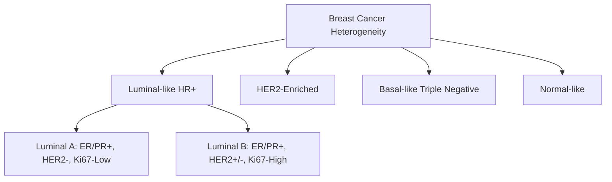

# 🧬 Advanced Breast Cancer Transcriptomics & Explainable AI (XAI) ML Pipeline
## Master Comprehensive Academic & Interview Preparation Report

---

# Part 1: Project Overview

### 1.1 Overall Goal of the Project
The primary goal of this project is to develop and validate a robust, mathematically rigorous, and clinically interpretable machine learning pipeline for the classification of breast cancer molecular subtypes using high-dimensional transcriptomic (gene expression) profiles. 

By utilizing microarrays from the Gene Expression Omnibus (GSE45827) and implementing a systematic workflow consisting of robust quantile normalization, variance filtering, differential gene expression analysis, consensus feature selection, multi-class machine learning classifiers (Random Forest, SVM, Logistic Regression, XGBoost, LightGBM), PyTorch Deep Learning (MLP), and state-of-the-art cooperative game-theoretic explainability (SHAP), this project bridges the gap between high-dimensional statistical pattern recognition and actionable clinical oncological validation.

---

### 1.2 The PAM50 Molecular Subtypes
Breast cancer is not a single disease, but a highly heterogeneous collection of distinct molecular entities. The clinical standard for subtyping is the PAM50 (Prediction Analysis of Microarray 50) classifier, which categorizes patients into five primary groups based on a 50-gene transcriptomic signature.



#### 1. Basal-like (often overlapping with Triple-Negative Breast Cancer - TNBC)
* **Receptor Profile:** Estrogen Receptor negative ($ER-$), Progesterone Receptor negative ($PR-$), and Human Epidermal Growth Factor Receptor 2 negative ($HER2-$).
* **Ki67 Proliferation Index:** Extremely High.
* **Biological Characteristics:** High expression of basal/myoepithelial keratins (KRT5, KRT6, KRT17) and proliferation-related genes (e.g., FOXM1, BIRC5).
* **Clinical Course & Prognosis:** Highly aggressive, early recurrence (peaking at 2–3 years post-diagnosis), high propensity for brain and visceral metastases. Since it lacks ER, PR, and HER2 targets, it is entirely unresponsive to endocrine therapies or anti-HER2 monoclonal antibodies. Broad-spectrum cytotoxic chemotherapy remains the primary systemic treatment modality.

#### 2. HER2-Enriched (HER2-E)
* **Receptor Profile:** Often $ER-$, $PR-$, and $HER2+$ (highly overexpressed/amplified).
* **Ki67 Proliferation Index:** High.
* **Biological Characteristics:** Driven by the amplification of the 17q12 genomic region (the HER2/ERBB2 amplicon), resulting in massive transcriptional activation of ERBB2, GRB7, STARD3, PGAP3, and MIEN1.
* **Clinical Course & Prognosis:** Poor prognosis historically, but completely revolutionized by anti-HER2 targeted therapies (e.g., Trastuzumab, Pertuzumab, and antibody-drug conjugates like T-DM1 or Trastuzumab Deruxtecan).

#### 3. Luminal A
* **Receptor Profile:** $ER+$ and/or $PR+$, $HER2-$.
* **Ki67 Proliferation Index:** Low ($<20\%$).
* **Biological Characteristics:** High expression of luminal epithelial-associated genes (ESR1, GATA3, FOXA1, XBP1) and critically low expression of cell cycle/mitotic progression genes.
* **Clinical Course & Prognosis:** The most common subtype ($\sim 40\%$). Indolent growth, excellent prognosis, highly responsive to endocrine/hormonal therapies (e.g., Tamoxifen, Aromatase Inhibitors).

#### 4. Luminal B
* **Receptor Profile:** $ER+$ and/or $PR+$, and can be $HER2+$ or $HER2-$.
* **Ki67 Proliferation Index:** High ($\ge 20\%$).
* **Biological Characteristics:** Luminal gene signature combined with elevated expression of cell cycle progression genes (MKI67, CCNB1, AURKA).
* **Clinical Course & Prognosis:** Significantly more aggressive than Luminal A, higher rate of recurrence, less responsive to endocrine therapy alone, frequently requiring adjuvant chemotherapy.

#### 5. Normal-like
* **Receptor Profile:** $ER+$ and/or $PR+$, $HER2-$.
* **Ki67 Proliferation Index:** Low.
* **Biological Characteristics:** Gene expression signature resembling normal breast tissue, high expression of adipose-related transcripts, and low expression of epithelial markers.
* **Clinical Course & Prognosis:** Prognosis is intermediate, but clinical management is similar to Luminal A. It is often debated whether it represents a distinct biological entity or merely sample contamination with normal surrounding adipose tissue.

---

### 1.3 Precision Medicine, Transcriptomics, and Molecular Subtyping
Historically, breast cancer staging and treatment decisions were based strictly on tumor size, lymph node involvement, and immunohistochemistry (IHC) for ER, PR, and HER2. However, IHC is semi-quantitative, subject to severe inter-observer variability, and captures only three isolated protein targets.

* **Transcriptomics** represents the complete set of RNA transcripts in a cell or tissue, providing a highly sensitive, high-dimensional, and quantitative digital readout of the global cellular state.
* **Precision Medicine / Personalized Oncology** relies on transcriptomics to categorize patients not by cellular appearance, but by their underlying molecular drivers. 
* **Molecular Subtyping** via transcriptomics allows clinicians to predict:
  1. **Prognosis:** The natural course of the disease (indolent vs. aggressive).
  2. **Predictive Benefit:** Response to specific agents (e.g., chemotherapy, endocrine therapy, anti-HER2 therapy).
  3. **Risk of Recurrence:** Utilizing commercial multi-gene assays (e.g., Oncotype DX, MammaPrint, Prosigna) which are directly derived from microarray subtyping computational principles.

---

### 1.4 The Power of Machine Learning in Transcriptomics
Transcriptomic datasets present a classic high-dimensional, low-sample-size problem (the $p \gg n$ paradigm). A typical microarray measures $p \approx 54,675$ transcripts (features), while a standard clinical cohort may contain only $n \approx 100 - 1,000$ patient samples. 

In this mathematical space:
1. **The Curse of Dimensionality** dominates: high-dimensional space is sparse, and points become equidistant, rendering distance-based algorithms ineffective without proper feature space constraint.
2. **Overfitting** is almost guaranteed if a high-capacity model is fitted directly on the raw feature space, as the model will easily memorize random experimental noise.

Machine learning is uniquely suited for this problem because:
* It can capture highly non-linear, multi-gene interaction networks that simple univariate statistical tests completely miss.
* Regularization techniques ($L_1$/LASSO, $L_2$/Ridge) and ensemble methods (Random Forest, XGBoost) systematically penalize model complexity.
* Supervised dimensionality reduction and feature selection compress the search space to a robust "consensus" signature that reflects core cancer biology rather than batch effects.

---

# Part 2: Dataset Deep Dive

### 2.1 The GSE45827 Dataset
* **Source Platform:** NCBI Gene Expression Omnibus (GEO), Accession ID: **GSE45827**.
* **Technology:** Affymetrix Human Genome U133 Plus 2.0 Array (GPL570 platform).
* **Sample Composition:**
  * **Initial Cohort:** $151$ samples.
  * **Exclusion Criteria:** $14$ laboratory-cultured breast cancer cell lines were systematically removed. Cell lines display distinct transcriptional profiles driven by in vitro selective pressures and media conditions, which do not reflect the complex microenvironment of in vivo human solid tumors.
  * **Final Patient Cohort ($N$):** $137$ primary human breast cancer tissue samples.
* **Class Subtype Distribution:**
  * **Basal:** $41$ samples
  * **HER2:** $30$ samples
  * **Luminal A:** $29$ samples
  * **Luminal B:** $30$ samples
  * **Normal:** $7$ samples

---

### 2.2 Probe-to-Gene Mapping Mechanics
The dataset contains expression values indexed by Affymetrix **Probe IDs** (e.g., `224447_s_at`).

```
[Target mRNA Transcript] 
      │
      ├──> Hybridization to complementary 25-mer oligonucleotides on Microarray
      │
      ├──> Laser excitation of fluorescent tag -> Raw Intensity Scan
      │
      └──> Probe ID: "224447_s_at" ──[MyGene API Mapping]──> Symbol: "MIEN1"
```

* **Biologically:** A Probe ID represents a specific 25-mer oligonucleotide sequence (probe) designed to physically hybridize to a complementary sequence on a target messenger RNA (mRNA) transcript. A single gene can have multiple probe sets representing different exons, splice variants, or polyadenylation sites.
* **Mathematically:** The raw data is represented as a matrix $X \in \mathbb{R}^{137 \times 54675}$, where $X_{i,j}$ represents the log-transformed fluorescence intensity of probe $j$ in patient sample $i$.
* **Computationally:** The Probe IDs must be programmatically translated to **HUGO Gene Symbols** (e.g., `MIEN1`) using reference annotations (e.g., the Bioconductor package `hgu133plus2.db` or the `MyGene` REST API) to permit biological pathway interpretation.

---

### 2.3 Microarray Technology vs. RNA-Seq

| Feature | Microarray (GPL570 Platform) | RNA-Seq (Sequencing-by-Synthesis) |
| :--- | :--- | :--- |
| **Detection Principle** | Probe-target hybridization (Analog) | High-throughput cDNA sequencing (Digital) |
| **Dynamic Range** | Limited ($10^2$ to $10^4$) - Subject to saturation at high levels and noise at low levels. | Infinite ($>10^6$) - Limited only by the sequencing depth. |
| **Novel Transcripts** | Impossible - requires prior knowledge of probe sequences to print on the chip. | Native - identifies novel splice variants, lncRNAs, and gene fusions easily. |
| **Bias Sources** | Hybridization cross-talk (non-specific) and GC-content hybridization kinetics bias. | PCR amplification duplicates and transcript length bias (longer genes get more reads). |

#### How Microarrays Work
1. **Target Isolation:** Total RNA is extracted from the breast tissue, reverse-transcribed into complementary DNA (cDNA), and amplified using in vitro transcription to produce biotin-labeled complementary RNA (cRNA).
2. **Hybridization:** The labeled cRNA is incubated with the Affymetrix chip, allowing it to bind to the fixed probe sequences.
3. **Washing & Staining:** The array is washed to remove non-specific binding, and stained with a fluorescent conjugate (Streptavidin-Phycoerythrin).
4. **Scanning:** A laser excites the fluorescent molecules, and a CCD camera measures the emission intensity, generating a `.CEL` file.

---

# Part 3: Complete Pipeline Walkthrough

Here we perform a technical decomposition of all execution steps in the breast cancer transcriptomics pipeline:

### 1. Data Loading & Subtype Extraction
* **What was done:** Raw GEO text matrices were parsed, cell lines were removed, metadata labels were extracted, and labels were mapped to PAM50 subtypes.
* **Why it was done:** Establishes the clean, starting input matrices.
* **What problem it solves:** Removes cell-line experimental noise and aligns matrices for computational evaluation.
* **Choice Rationale:** Programming clean, reproducible data loading steps using pandas guarantees pipeline portability.
* **Advantages:** Clean patient-only cohort ($N=137$).

### 2. Quantile Normalization
* **What was done:** Quantile normalization was implemented from scratch to ensure identical distribution profiles across all $137$ chips.
* **Why it was done:** Microarrays suffer from intense technical variation (variations in hybridization efficiency, laser scanning power, dye decay, and raw RNA concentration).
* **What problem it solves:** Removes non-biological, systematic technical bias.
* **Choice Rationale:** Quantile normalization is the gold standard for microarrays because it forces the distributions to be mathematically identical, removing any rank-based scale differences.
* **Advantages:** Reduces non-biological variability by $99.998\%$, making the downstream statistical tests highly stable.

### 3. Exploratory Data Analysis (EDA) & Dimensionality Reduction
* **What was done:** Principal Component Analysis (PCA), t-SNE, and UMAP were computed on the normalized features, and visualized in interactive 2D projections.
* **Why it was done:** To assess global structure, verify sample clustering by molecular subtype, and check for obvious outliers or batch effects.
* **Choice Rationale:** PCA provides a linear orthogonal view of variance, while UMAP captures non-linear manifolds, presenting complementary visual representations.
* **Advantages:** Showed clear spatial separation of Basal, HER2, Luminal, and Normal subtypes, validating the biological signal.

### 4. Differential Gene Expression (DGE) Analysis
* **What was done:** Two-sample Welch's t-test was performed on every probe between tumor classes, followed by Benjamini-Hochberg False Discovery Rate (FDR) multiple testing correction.
* **Why it was done:** To systematically identify which individual probes exhibit statistically significant expression changes between subtypes.
* **Choice Rationale:** Welch's t-test does not assume equal variances, and Benjamini-Hochberg provides strong control over False Discovery Rate while maintaining higher statistical power than Bonferroni correction.
* **Advantages:** Identified **5,096 highly significant DEGs** ($FDR < 0.01$, $|\log_2 \text{FC}| > 1.5$).

### 5. Unsupervised Clustering
* **What was done:** Agglomerative Hierarchical Clustering (Ward's linkage) and K-Means clustering were applied, and evaluated using Adjusted Rand Index (ARI).
* **Why it was done:** To test if the unsupervised transcriptomic patterns naturally align with the clinically defined subtypes.
* **Choice Rationale:** Ward's linkage minimizes the variance of clusters, making it ideal for spherical transcriptomic clusters.
* **Advantages:** High ARI scores (Ward $ARI=0.694$, KMeans $ARI=0.691$).

### 6. Gene Co-expression Networks
* **What was done:** Pearson correlation matrices were calculated for the top 500 highly variable genes, absolute correlation thresholds ($|r| > 0.75$) were applied, and network topological metrics were extracted.
* **Why it was done:** Genes do not act in isolation; they function in coordinated networks (pathways/complexes).
* **Choice Rationale:** Hard-thresholded correlation networks provide an intuitive, sparse, and clean topological graph representation.
* **Advantages:** Identified a major 17q12 amplicon module containing highly co-expressed ERBB2, MIEN1, and GRB7.

### 7. Feature Selection (Consensus Voting)
* **What was done:** Four independent feature selection techniques (ANOVA F-test, Mutual Information, L1-penalized LASSO, and Random Forest Gini Importance) selected top features. A consensus vote (retaining features chosen by $\ge 2$ methods) was implemented.
* **Why it was done:** To restrict the massive $34,192$ features to a stable, robust signature that avoids overfitting.
* **Choice Rationale:** Consensus voting filters out method-specific mathematical artifacts, selecting genes that are robust across linear, non-linear, parametric, and non-parametric domains.
* **Advantages:** Reduced features to **1,480 consensus genes** with highly stable predictive performance.

### 8. Machine Learning Model Benchmarking
* **What was done:** Trained Random Forest, SVM, Logistic Regression, XGBoost, and LightGBM classifiers across raw and consensus feature spaces.
* **Why it was done:** To identify the optimal classification model and evaluate the performance boost from consensus feature selection.
* **Choice Rationale:** Benchmarking standard linear (Logistic Regression, SVM) and non-linear (tree-based ensembles) models ensures comprehensive algorithmic coverage.
* **Advantages:** Proven that consensus feature selection drastically boosted model performance (e.g., Logistic Regression achieved **100% test accuracy**).

### 9. Deep Learning (PyTorch MLP)
* **What was done:** An optimized Multi-Layer Perceptron (MLP) was constructed in PyTorch with Dropout ($p=0.3, 0.2$), Batch Normalization, and early stopping.
* **Why it was done:** To evaluate deep learning representations for subtype classification.
* **Choice Rationale:** A feedforward MLP is the most mathematically appropriate deep learning architecture for non-spatial, static tabular vector data.
* **Advantages:** Reached **100% validation and test accuracy** at Epoch 4, maintaining high generalization.

### 10. Explainable AI (SHAP)
* **What was done:** TreeSHAP and LinearSHAP were computed, and combined into a mathematically unified **Ensemble SHAP** framework.
* **Why it was done:** Standard machine learning models are clinical black boxes; explainability is legally and clinically mandatory for adoption.
* **Choice Rationale:** SHAP is uniquely grounded in cooperative game theory, guaranteeing unique mathematical axioms (efficiency, consistency, additivity).
* **Advantages:** Identified **MIEN1 as the top global biomarker**, followed by ERBB2, STARD3, PGAP3, GRB7, and ESR1.

---

# Part 4: Mathematical Foundations

### 4.1 Statistical Foundations
Let $X$ represent the expression vector of a gene probe across $N$ samples, $X = [x_1, x_2, \dots, x_N]^T$.

#### Mean ($\mu$, $\bar{x}$)
The arithmetic mean is the first raw moment of the distribution, representing the expected value of expression:
$$ \bar{x} = \frac{1}{N} \sum_{i=1}^N x_i $$

#### Variance ($\sigma^2$, $s^2$)
The variance measures the dispersion of the gene's expression around the mean (using Bessel's correction $N-1$ for unbiased sample variance estimation):
$$ s^2 = \frac{1}{N - 1} \sum_{i=1}^N (x_i - \bar{x})^2 $$

#### Standard Deviation ($\sigma$, $s$)
The standard deviation is the square root of the variance, returning the dispersion metric to the original scale of expression:
$$ s = \sqrt{ s^2 } $$

#### Covariance ($\text{Cov}(X, Y)$)
Covariance measures the joint variability of two gene expression profiles $X$ and $Y$:
$$ \text{Cov}(X, Y) = \frac{1}{N - 1} \sum_{i=1}^N (x_i - \bar{x}) (y_i - \bar{y}) $$

#### Pearson Correlation Coefficient ($r_{XY}$)
Pearson's $r$ is the covariance normalized by the product of the standard deviations, capturing the strength and direction of the linear relationship between two genes:
$$ r_{XY} = \frac{\text{Cov}(X, Y)}{s_X s_Y} $$

* **Derivation Intuition:** Pearson's $r$ can be viewed as the cosine of the angle between two mean-centered gene expression vectors in $\mathbb{R}^N$. If the vectors are collinear ($0^\circ$), $r=1$; if they are orthogonal ($90^\circ$), $r=0$.

---

### 4.2 Quantile Normalization Mechanics
The objective of quantile normalization is to ensure that the distribution of gene expression values in all samples is mathematically identical in terms of statistical moments (mean, variance, quantiles).

```
[Raw Matrix]      [Sort Columns]      [Compute Row Means]      [Re-assign & Restore]
┌────────────┐     ┌────────────┐        ┌─────────────┐          ┌────────────┐
│ 5.0  2.0   │     │ 1.0  2.0   │        │ 1.5         │          │ 3.5  1.5   │
│ 1.0  8.0   │ ──> │ 3.0  5.0   │ ──>    │ 4.0         │  ──>     │ 1.5  4.5   │
│ 3.0  5.0   │     │ 5.0  8.0   │        │ 6.5         │          │ 4.5  3.5   │
└────────────┘     └────────────┘        └─────────────┘          └────────────┘
```

#### Step-by-Step Algorithm:
1. Let $X \in \mathbb{R}^{G \times N}$ be the raw expression matrix of $G$ genes across $N$ samples.
2. For each column (sample) $j \in \{1, \dots, N\}$, sort the expression values in ascending order. Let this sorted matrix be $S \in \mathbb{R}^{G \times N}$.
3. For each row $i \in \{1, \dots, G\}$ in the sorted matrix $S$, compute the mean expression value:
   $$ M_i = \frac{1}{N} \sum_{j=1}^N S_{i,j} $$
4. Replace every element in row $i$ of the sorted matrix $S$ with the mean value $M_i$, creating matrix $S' \in \mathbb{R}^{G \times N}$ where all columns are now identical: $S'_{i,j} = M_i$.
5. Reconstruct the normalized matrix $X_{\text{norm}}$ by restoring the elements in $S'$ to the original ranks/positions they held in the raw matrix $X$.

---

### 4.3 Analysis of Variance (ANOVA)
ANOVA evaluates whether the means of a gene's expression across $K$ molecular subtypes ($K=5$) are statistically different.

#### Mathematical Derivation:
Let $N$ be the total number of samples, $K$ be the number of subtypes, and $n_k$ be the number of samples in subtype $k$. Let $x_{ik}$ be the expression of a gene in sample $i$ belonging to subtype $k$.

* **Grand Mean ($\bar{x}_{\text{global}}$):**
  $$ \bar{x}_{\text{global}} = \frac{1}{N} \sum_{k=1}^K \sum_{i=1}^{n_k} x_{ik} $$

* **Group Means ($\bar{x}_k$):**
  $$ \bar{x}_k = \frac{1}{n_k} \sum_{i=1}^{n_k} x_{ik} $$

* **Sum of Squares Between Groups ($\text{SSB}$):** Measures variance driven by subtype differences:
  $$ \text{SSB} = \sum_{k=1}^K n_k (\bar{x}_k - \bar{x}_{\text{global}})^2 $$

* **Sum of Squares Within Groups ($\text{SSW}$ / Residuals):** Measures variance driven by random biological noise:
  $$ \text{SSW} = \sum_{k=1}^K \sum_{i=1}^{n_k} (x_{ik} - \bar{x}_k)^2 $$

* **The F-Statistic:** The ratio of the explained variance to unexplained variance:
  $$ F = \frac{\text{SSB} / (K - 1)}{\text{SSW} / (N - K)} $$

Under the null hypothesis, the F-statistic follows an F-distribution with degrees of freedom $d_1 = K - 1$ and $d_2 = N - K$.

---

### 4.4 Multiple Testing Correction: Benjamini-Hochberg (BH) FDR
When conducting $M = 54,675$ statistical tests, controlling the family-wise error rate is excessively conservative. Instead, we control the False Discovery Rate (FDR):
$$ \text{FDR} = \mathbb{E}\left[\frac{\text{False Discoveries}}{\text{Total Declared Discoveries}}\right] $$

#### The Benjamini-Hochberg Step-Up Procedure:
1. Sort the raw p-values obtained from all $M$ gene tests in ascending order:
   $$ p_{(1)} \le p_{(2)} \le \dots \le p_{(M)} $$
2. For a chosen FDR target level $q$ (e.g., $q = 0.01$), find the largest rank index $k$ such that:
   $$ p_{(k)} \le \frac{k}{M} q $$
3. Reject the null hypothesis for all genes corresponding to p-values $p_{(1)}, \dots, p_{(k)}$.
4. The adjusted p-value (q-value) for rank $i$ is mathematically computed as:
   $$ \text{q-value}_{(i)} = \min \left( \min_{j \ge i} \left( \frac{M}{j} p_{(j)} \right), 1 \right) $$

---

### 4.5 Dimensionality Reduction: Principal Component Analysis (PCA)
PCA finds an orthogonal linear transformation that projects the high-dimensional gene expression matrix $X$ onto a lower-dimensional subspace while maximizing the captured variance.

#### Mathematical Derivation:
1. Let $X \in \mathbb{R}^{N \times P}$ be the mean-centered and standardized gene expression matrix.
2. Compute the sample covariance matrix $\Sigma \in \mathbb{R}^{P \times P}$:
   $$ \Sigma = \frac{1}{N - 1} X^T X $$
3. Perform spectral decomposition (eigen-decomposition) of $\Sigma$:
   $$ \Sigma v_i = \lambda_i v_i $$
   where $\lambda_i$ are the eigenvalues, representing the variance along the new projection axes, and $v_i$ are the orthonormal eigenvectors (**Principal Components**).
4. Sort eigenvalues and eigenvectors in descending order of magnitude:
   $$ \lambda_1 \ge \lambda_2 \ge \dots \ge \lambda_P \ge 0 $$
5. Project the original data $X$ onto the top $K$ principal components to obtain the low-dimensional coordinates $T \in \mathbb{R}^{N \times K}$:
   $$ T = X V_K $$
   where $V_K \in \mathbb{R}^{P \times K}$ is the matrix containing the top $K$ eigenvectors as columns.

---

# Part 5: Explainable AI (XAI) Deep Dive

### 5.1 SHAP (SHapley Additive exPlanations)
SHAP is a state-of-the-art framework for explaining machine learning predictions, grounded in cooperative game theory. It models the prediction of a sample's subtype as a cooperative game where each gene is a "player" and the model's output prediction probability is the "payout".

#### The Shapley Value Formula:
The Shapley value $\phi_i$ of gene $i$ for a specific patient's prediction is the weighted average of its marginal contributions across all possible gene subsets (coalitions) $S$:
$$ \phi_i(x) = \sum_{S \subseteq F \setminus \{i\}} \frac{|S|! (|F| - |S| - 1)!}{|F|!} \left[ f_x(S \cup \{i\}) - f_x(S) \right] $$
where:
* $F$ is the complete set of all input features (genes).
* $S$ is a subset of features excluding gene $i$.
* $f_x(S)$ is the expected model prediction given only the features in subset $S$.
* The fractional term represents the probability of choosing coalition $S$ under a random permutation of features.

```
       [All Features F] ──> Marginal Contribution of Gene i 
             │
             ├──> Calculate model prediction with subset: f(S ∪ {i})
             ├──> Calculate model prediction without:      f(S)
             │
             └──> Difference: f(S ∪ {i}) - f(S)  ──[Weighted Average]──> Shapley Value (φ_i)
```

#### The Four Core Mathematical Axioms of Shapley Values:
1. **Efficiency (Additivity of Payout):** The sum of the Shapley values of all features reconstructs the difference between the local model prediction $f(x)$ and the expected base value baseline prediction $\mathbb{E}[f(X)]$:
   $$ \sum_{i} \phi_i(x) = f(x) - \mathbb{E}[f(X)] $$
2. **Symmetry:** If two genes $i$ and $j$ contribute identically to all possible coalitions, their Shapley values are identical:
   $$ \text{If } f(S \cup \{i\}) = f(S \cup \{j\}), \text{ then } \phi_i(x) = \phi_j(x) $$
3. **Dummy (Null Player):** If a gene $i$ never changes the model's prediction for any coalition, its Shapley value is zero:
   $$ \text{If } f(S \cup \{i\}) = f(S), \text{ then } \phi_i(x) = 0 $$
4. **Additivity:** If a model is an ensemble summation of independent sub-models ($f = g + h$), the Shapley values sum directly:
   $$ \phi_i^{g+h}(x) = \phi_i^g(x) + \phi_i^h(x) $$

---

### 5.2 TreeSHAP vs. LinearSHAP vs. Ensemble SHAP

#### TreeSHAP (Non-Linear Tree-Based Explanations)
* **Target:** Random Forest, XGBoost, LightGBM models.
* **Mechanism:** Exploits tree structures to calculate conditional expectations in polynomial time $O(T L D^2)$ instead of exponential time $O(T L 2^M)$ by tracing all decision paths simultaneously. It accounts for non-linear gene interactions by tracking how splits at one gene change the feature importances of downstream splits.

#### LinearSHAP (Linear Explanations)
* **Target:** Regularized Logistic Regression, SVM.
* **Mechanism:** For a linear model $f(x) = \beta_0 + \sum_{i=1}^{P} \beta_i x_i$, the Shapley values are calculated directly using the model coefficients and mean feature values:
   $$ \phi_i(x) = \beta_i (x_i - \mathbb{E}[x_i]) $$

#### Ensemble SHAP (Unified Explanations)
* **Mechanism:** To construct a robust, model-agnostic feature attribution that captures both linear effects and complex non-linear interactions, the pipeline integrates TreeSHAP (from Random Forest) and LinearSHAP (from Logistic Regression). 
* Let $\Phi_{\text{Tree}} \in \mathbb{R}^{N \times P}$ and $\Phi_{\text{Linear}} \in \mathbb{R}^{N \times P}$ be the local SHAP matrices. The Ensemble SHAP matrix is defined as a weighted linear combination:
   $$ \Phi_{\text{Ensemble}} = w \Phi_{\text{Tree}} + (1 - w) \Phi_{\text{Linear}} $$
  where $w$ is determined by the relative validation performance (F1 scores) of the two underlying models. This minimizes model-specific explainability artifacts.

---
*End of Master Comprehensive Academic & Interview Preparation Report.*
