<div align="center">

# OncoResolve: High-Hygiene Explainable AI and Patient-Centric Uniqueness Framework for Breast Cancer Subtyping

### An end-to-end RNA-seq transcriptomics, machine learning, and N-of-1 precision oncology pipeline for classifying PAM50 breast cancer molecular subtypes with SHAP explainability and cross-platform external validation.

[](https://www.python.org/)
[](https://scikit-learn.org/)
[](#)

[](https://doi.org/10.5281/zenodo.20565148)
[](https://oncoresolve.streamlit.app/)
[](https://colab.research.google.com/github/shubhamkjha369/OncoResolve-Breast-Cancer-Transcriptomics/blob/main/notebooks/OncoResolve_Subtyping_and_Precision_Profiling.ipynb)
[](LICENSE)

**Shubham Jha · AI Data Scientist & Computational Biology Independent Researcher**

[](https://github.com/shubhamkjha369)
[](https://www.linkedin.com/in/shubhamjha369/)
[](mailto:shubhamkjha369@gmail.com)

</div>

---

## Table of Contents

- [Abstract](#abstract)
- [Project Aim](#project-aim)
- [Pipeline Workflow & Architecture](#pipeline-workflow)
- [1. Patient Cohorts: Validating Across the Globe](#patient-cohorts)
- [2. Biomarker Discovery: Sifting for the Core 178 Genes](#biomarker-discovery)
- [3. Subtype Predictors: High-Performance Diagnostic Classification](#subtype-predictors)
- [4. Explainable AI: Understanding the Decisions (SHAP)](#explainable-ai)
- [5. N-of-1 Personal Profiling: The Composite Uniqueness Score (CUS)](#personal-profiling)
- [6. Prognosis & Outcomes: Predicting Survival Risk](#prognosis-outcomes)
- [7. Biological Validation: CRISPR Knockouts & LINCS Drug Discovery](#biological-validation)
- [Limitations & Future Work](#limitations)
- [References](#references)
- [Author](#author)
- [Citation](#citation)
- [License](#license)
---

<a id="abstract"></a>
## Abstract

Breast cancer is a highly heterogeneous disease characterized by transcriptionally distinct molecular subtypes (PAM50 classification) that dictate therapeutic intervention and clinical prognosis. While computational subtyping from high-throughput RNA-seq transcriptomics has advanced precision oncology, many existing machine learning models suffer from technical flaws including row-level data leakage, unvalidated feature selections, and poor generalizability across disparate profiling platforms.

Using a primary cohort of 1,084 patient transcriptomes (981 post-QC) from the TCGA-BRCA Pan-Cancer Atlas across all five PAM50 subtypes including Normal-like, we implement an anti-leakage cross-validation protocol where Z-score standardization (`StandardScaler`) and a consensus feature selection ensemble utilizing majority voting (ANOVA, LASSO, Random Forest Gini) are fit strictly within each training partition. Multi-class linear models achieve outstanding classification performance, which we explain globally and locally using LinearSHAP to map decisions to validated breast cancer biomarkers (e.g., *ESR1*, *ERBB2*, *MKI67*). Furthermore, we introduce the Composite Uniqueness Score (CUS)—an advanced N-of-1 mathematical framework combining topological network distance and autoencoder reconstruction error to measure transcriptomic uniqueness at the individual level. We show that individual uniqueness signatures are biologically orthogonal to global subtype signals (Jaccard similarity ~0.0), and we formally validate that CUS is not merely a proxy for standard anomaly detection baselines: Spearman correlations between CUS and Euclidean, PCA-reconstruction, and Isolation Forest scores reveal only partial overlap (r = 0.67, 0.65, and 0.64, respectively), while CUS achieves a significantly higher chi-square statistic against PAM50 subtype (χ² = 262.03, p = 1.64×10⁻⁵⁶) compared to all three baselines, confirming that CUS captures a uniquely biologically structured dimension of individual transcriptomic variation. We further validate consensus biomarker selection through $B=100$ bootstrap resamples (F1-Consensus JSI = 0.2035) and $P=500$ permutation tests, and demonstrate that predicted class probabilities are accurately calibrated across all external cohorts (max ECE < 13.64%). Finally, we demonstrate the robustness and clinical transportability of the locked OncoResolve discovery pipeline by successfully validating it across three independent external cohorts: **SMC 2018** (South Korea, N=168; Logistic Regression ROC-AUC=0.9771), **SCAN-B** (Sweden/GSE96058, N=340; Support Vector Machine ROC-AUC=0.9755), and **METABRIC** (Illumina microarray, N=1,756; Support Vector Machine ROC-AUC=0.8939), demonstrating high diagnostic transferability across platforms and cohorts despite extreme platform-specific profiling shifts. A Consensus Ridge Cox Risk Score (CRS) built on the 178 consensus genes achieves C-indices of **0.756** (TCGA), **0.6493** (SCAN-B), and **0.5834** (METABRIC), with significant log-rank survival separation (OS p = 0.024).

---


> [!IMPORTANT]
> ## ▶ Reproducibility — Run These Steps First, In Order
>
> To reproduce the results, you **must** execute the following steps in sequence. The execution weaves between data preparation, model training, and systems biology research, beginning with data extraction in the **Main Analysis Notebook**, followed by the **Model Training & Validation Notebook**, and concluding with the remainder of the **Main Analysis Notebook**.
>
> ### Step 1 — Download All Raw Datasets
> ```bash
> python data/external_cohort/download_external_cohorts.py
> ```
> **What it does:** Downloads the three required datasets via public APIs (cBioPortal + NCBI GEO FTP):
> - **TCGA-BRCA Pan-Can Atlas 2018** → [`Breast_TCGA_BRCA_RNAseq.csv`](https://cbioportal-datahub.s3.amazonaws.com/brca_tcga_pan_can_atlas_2018.tar.gz) + [`Breast_TCGA_BRCA_clinical.csv`](https://cbioportal-datahub.s3.amazonaws.com/brca_tcga_pan_can_atlas_2018.tar.gz) *(cBioPortal study: `brca_tcga_pan_can_atlas_2018` — or run the download script below)*
> - **METABRIC** (N=1,980, microarray) → `data/external_cohort/METABRIC_expression.csv` + `METABRIC_clinical.csv`
> - **SCAN-B / GSE96058** (N=3,273, RNA-seq) → `data/external_cohort/SCANB_GSE96058_expression_subset.csv` + `SCANB_GSE96058_clinical.csv`
>
> ⏱ *Allow 5–30 minutes depending on your internet connection. The SCAN-B expression file alone is ~564 MB.*
>
> ### Step 2 — Run Discovery Preprocessing & Feature Selection
> Open and run **Sections 1 to 7** of the main analysis notebook:
> ```
> notebooks/OncoResolve_Subtyping_and_Precision_Profiling.ipynb
> ```
> **What it does:** Preprocesses raw TCGA-BRCA data, splits it into Discovery and Holdout partitions, and discovers the **50 consensus biomarker signature** via a tri-method ensemble. This creates the foundational artifacts (`top_deg_genes.pkl`, `label_encoder_cohort.pkl`, and `df_discover.parquet`) required by the external validation scripts and notebooks.
>
> ### Step 3 — Prepare and Harmonize External Cohorts
> ```bash
> python data/external_cohort/prepare_external_cohorts.py
> ```
> **What it does:** Processes the raw downloaded files into clean, analysis-ready parquets:
> - Filters METABRIC to valid PAM50 cancer subtypes (`LumA`, `LumB`, `Her2`, `Basal`, `claudin-low`)
> - Filters SCAN-B using the GSM→f_id barcode mapping (`SCANB_mapping.csv`)
> - Audits gene identifier overlap between TCGA-BRCA training genes and both external cohorts
> - Generates cross-cohort PCA compatibility plot → `data/artifacts/cross_cohort_pca_compatibility.png`
> - Saves: `data/processed/METABRIC_expression_clean.parquet` + `SCANB_expression_clean.parquet`
>
> ### Step 4 — Run the External Cohort Preparation Notebook
> Open and run **all cells** in:
> ```
> notebooks/External_cohort_data_preparation_analysis.ipynb
> ```
> **What it does:** Performs the final cross-platform harmonization, gene-symbol alignment, and format validation needed before external validation:
> - Aligns METABRIC and SCAN-B expression matrices to the TCGA-BRCA consensus gene namespace
> - Validates SMC 2018 cohort data (`data/external_cohort/SMC_2018_expression.csv`)
> - Saves the final validated external cohort parquets consumed by validation and training pipelines
>
> ### Step 5 — Run the Model Training & Validation Notebook (Results Focus)
> Open and run the dedicated model training and validation notebook:
> ```
> notebooks/OncoResolve_Model_Training_Validation.ipynb
> ```
> **What it does:** Performs nested cross-validation and hyperparameter search across 10 classifiers (4 linear, 6 non-linear) on the 178 consensus genes, and evaluates performance on all external cohorts. This notebook focuses strictly on performance results, generalizability gaps, and validation statistics.
>
> ### Step 6 — Run the Main Analysis Notebook (Research & Testing Focus)
> Now run the remaining sections (Sections 8 to 17) of the primary notebook:
> ```
> notebooks/OncoResolve_Subtyping_and_Precision_Profiling.ipynb
> ```
> **What it does:** Performs intense exploratory and systems-biology research, including:
> - Global and local model explainability using LinearSHAP / KernelSHAP
> - Interactive Gene Co-expression Network (GCN) topological modeling
> - Patient similarity networks and N-of-1 Composite Uniqueness Score (CUS) profiling
> - Prognostic risk modeling using L2-regularized Ridge Cox Risk Scores (CRS)
>
> ---
>
> **Full Execution Order Summary:**
>
> | # | File / Steps | Type | Purpose |
> |---|---|---|---|
> | 1 | [`data/external_cohort/download_external_cohorts.py`](data/external_cohort/download_external_cohorts.py) | Python script | Downloads all raw datasets from cBioPortal + GEO |
> | 2 | [`notebooks/OncoResolve_Subtyping_and_Precision_Profiling.ipynb`](notebooks/OncoResolve_Subtyping_and_Precision_Profiling.ipynb) (Sections 1-7) | Jupyter notebook | Generates discovery partition and locked consensus gene set |
> | 3 | [`data/external_cohort/prepare_external_cohorts.py`](data/external_cohort/prepare_external_cohorts.py) | Python script | Cleans, filters, and harmonizes external cohorts |
> | 4 | [`notebooks/External_cohort_data_preparation_analysis.ipynb`](notebooks/External_cohort_data_preparation_analysis.ipynb) | Jupyter notebook | Final cross-platform gene alignment and validation |
> | 5 | [`notebooks/OncoResolve_Model_Training_Validation.ipynb`](notebooks/OncoResolve_Model_Training_Validation.ipynb) | Jupyter notebook | Dedicated model training, hyperparameter optimization, and external cohort validation |
> | 6 | [`notebooks/OncoResolve_Subtyping_and_Precision_Profiling.ipynb`](notebooks/OncoResolve_Subtyping_and_Precision_Profiling.ipynb) (Sections 8-17) | Jupyter notebook | Main research analysis, explainability, networks, and uniqueness profiling |
> 
> ### 📦 Modular Python Library: `oncoresolve`
> 
> The core OncoResolve subtyping, explainability, personal profiling (CUS), and survival modeling algorithms are packaged as a reusable python library.
> 
> **Installation:**
> ```bash
> pip install -e .
> ```
> 
> **Example Usage:**
> ```python
> import oncoresolve as orr
> import pandas as pd
> 
> # 1. Prepare and Harmonize your custom RNA-seq expression matrix (genes as columns)
> df_clean = orr.harmonize_namespaces(df_raw, "data/artifacts/tcga_entrez_to_hugo.pkl")
> df_scaled = orr.scale_cohort(df_clean)
> 
> # Load locked top consensus genes list and align columns alphabetically
> consensus_genes = list(pd.read_parquet("data/artifacts/final_consensus_biomarkers.parquet")["gene"])
> df_aligned = orr.align_features(df_scaled, consensus_genes)
> 
> # 2. Run classification using pre-trained SVM or Logistic Regression models
> clf = orr.OncoClassifier(model_type="svm")
> predictions = clf.predict(df_aligned)        # Returns PAM50 subtype strings
> probabilities = clf.predict_proba(df_aligned)  # Returns class probabilities DataFrame
> 
> # 3. Compute Patient Uniqueness Scores (CUS)
> df_cus = orr.compute_cus(df_aligned, barcodes=df_aligned.index, alpha=0.001)
> 
> # 4. Predict Overall Survival Risk Scores (Consensus Cox CRS)
> prog = orr.OncoPrognosis()
> risk_scores = prog.predict_risk(df_aligned)
> ```

---

<a id="project-aim"></a>
## Project Aim

Breast cancer is a highly heterogeneous disease. The **PAM50 molecular classification** (Perou et al., *Nature* 2000; Parker et al., *J Clin Oncol* 2009) defines five transcriptionally distinct subtypes with profoundly different prognoses, biomarker profiles, and therapeutic targets:

| Subtype | ER | PR | HER2 | Key Molecular Drivers | First-line Therapy |
|---|---|---|---|---|---|
| **Basal-like (TNBC)** | – | – | – | KRT5, KRT14, KRT17, FOXC1, CDH3 | Chemotherapy; PARP inhibitors (BRCA1/2-mutant) |
| **HER2-enriched** | – | – | + | ERBB2, GRB7, STARD3, PGAP3, MIEN1 | Trastuzumab (Herceptin) + Pertuzumab |
| **Luminal A** | + | + | – | ESR1, GATA3, FOXA1, PGR, TFF3; low Ki67 | Tamoxifen / Aromatase inhibitors |
| **Luminal B** | + | ± | ± | ESR1 + high MKI67, TOP2A, CCNB1, BIRC5 | Endocrine therapy + Chemotherapy |
| **Normal-like** | ± | ± | – | ADIPOQ, FABP4, CD36 (adipose-like signature) | Clinical monitoring |

**OncoResolve v3.3.3** is designed to address six specific technical and clinical objectives:

1. **Anti-leakage dual-architecture classification** — Deploy a finalized **Logistic Regression (Linear) + Support Vector Machine (RBF)** dual-model pipeline trained on **981 TCGA-BRCA** patients (including Normal-like subtype), where `StandardScaler` and ensemble feature selection (ANOVA, LASSO, Random Forest) are fit strictly *inside* each cross-validation training fold — eliminating the feature-selection leakage that affects >90% of published transcriptomics ML papers. Holdout performance (N=197): Logistic Regression ROC-AUC=**0.9914**, MCC=**0.8738**.

2. **178-gene consensus biomarker discovery with SHAP explainability** — Identify a stable, biologically validated set of **178 consensus genes** across all five PAM50 subtypes via a tri-method ensemble selector (ANOVA F-test + LASSO L1 + Random Forest Gini). Explain predictions using both **LinearSHAP** (Logistic Regression) and **KernelSHAP** (RBF-SVM), and fuse attributions into a **Logistic Regression LinearSHAP** that resolves inter-model scale differences. Key recovered biomarkers: *ERBB2*, *ESR1*, *KRT5*, *MKI67*, *GATA3*, *GRB7*, *FOXA1*, *STARD3*.

3. **N-of-1 Composite Uniqueness Score (CUS)** — Quantify individual patient transcriptomic uniqueness using an original mathematical framework combining Patient Similarity Network (PSN) distances with PyTorch Autoencoder reconstruction error. Formally validate that CUS is *not* a proxy for standard anomaly scores: CUS achieves the highest subtype-discriminative chi-square (χ²=**262.03**, p=1.64×10⁻⁵⁶) and Cox C-index (**0.7635**) vs. Euclidean, PCA reconstruction, and Isolation Forest baselines, while Jaccard overlap with global DGE pathways is ≈0.0 (confirming private biological signal).

4. **Cross-platform validation on three independent external cohorts** — Evaluate the completely locked discovery pipeline (no retraining) on:
   - **SMC 2018** (South Korea, Illumina RNA-seq, N=168): Logistic Regression ROC-AUC=**0.9771**, MCC=**0.7267**
   - **SCAN-B / GSE96058** (Sweden, Illumina NextSeq, N=340): Kernel SVM ROC-AUC=**0.9755**, MCC=**0.7639**
   - **METABRIC** (Canada/UK, Illumina HT-12 microarray, N=1,756): Kernel SVM ROC-AUC=**0.8939**, MCC=**0.6118**

   Cross-platform transfer requires per-cohort independent Z-score harmonization and strict alphabetical feature alignment — bypassing these steps collapses SVM accuracy to 11–21%.

5. **Rigorous consensus space validation** — Evaluate biomarker selection stability via $B=100$ bootstrap resamples (F1-Consensus JSI=**0.2035**) and $P=500$ empirical permutation tests. Confirm prediction probability calibration across all four cohorts (max ECE <**13.64%**; Brier Score <0.10) to meet peer-reviewed oncology journal standards.

6. **Transferable prognostic Consensus Ridge Cox Risk Score (CRS)** — Build an L2-regularized Ridge Cox model on the full consensus signature, yielding a continuous CRS validated across independent cohorts: TCGA C-index=**0.7560**, SCAN-B C-index=**0.6493**, METABRIC C-index=**0.5834** — extending OncoResolve from a diagnostic classifier to a multi-cohort prognostic tool.

---


<a id="pipeline-workflow"></a>
## Pipeline Workflow & Architecture

To ensure our findings are robust, generalizable, and free from computational bias, we followed a highly structured, 6-layer architecture that takes raw sequencing data all the way through machine learning prediction, explainability mapping, and biological validation:


### End-to-End Architectural Layers:
1. **Input & Harmonization Layer:** Loads raw datasets (TCGA-BRCA, SMC 2018, SCAN-B, METABRIC) and aligns them through independent cohort-specific Z-score scaling to correct for cross-platform batch effects.
2. **High-Hygiene Preprocessing Layer:** Implements a strict **Anti-Leakage Protocol (ALP)** where median imputation, variance thresholding, and standard scaling are calculated strictly within-fold during training, preventing downstream data leaks.
3. **Consensus Feature Selection Ensemble Layer:** Discovers biomarkers by running ANOVA F-test, LASSO L1, and Random Forest feature selectors in parallel, selecting genes nominated by $\ge$ 2 methods to lock a robust **178-gene signature**.
4. **Model Training & Hyperparameter Tuning Layer:** Employs a 5-Fold Stratified Nested Cross-Validation (outer loop) with 3-Fold GridSearchCV (inner loop) to train and optimize Logistic Regression and Support Vector Machine classifiers.
5. **Explainable AI (XAI) & Biomarker Mapping Layer:** Uses LinearSHAP and TreeSHAP to map local and global classification decisions back to clinical biomarkers (e.g., *ESR1*, *ERBB2*, *MKI67*).
6. **Precision Oncology & Outcomes Layer:** Computes an N-of-1 **Composite Uniqueness Score (CUS)** (Autoencoder reconstruction residual + topological network distance) for personalized profiling, and maps prognosis via a **Consensus Ridge Cox Risk Score (CRS)**.

---

<a id="patient-cohorts"></a>
## 1. Patient Cohorts: Validating Across the Globe

Cancer profiling technologies differ significantly between labs and countries. To prove our method works globally, we trained our models on one patient group and tested them on three completely independent groups without any retraining:

1. **TCGA-BRCA (United States - Discovery Cohort)**: Our primary group consisting of **981 patients** across all five PAM50 molecular subtypes. We split this into **784 patients** for training (discovery) and **197 patients** for testing (holdout).
   
   > [!NOTE]
   > **Sample Filtering & Cohort Size (N=981 vs. N=945)**
   > The workflow flowchart displays **N=945** (split into **756** discovery / **189** holdout), whereas the code and text utilize **N=981** (split into **784** discovery / **197** holdout). The step-by-step filtering is:
   > 1. **Initial TCGA-BRCA Dataset:** Starts with **1,084** raw patient records.
   > 2. **QC / Subtype Filtering:** Removing **103 samples** that lack defined PAM50 subtype labels (`NaN`) in the clinical metadata yields **981 samples** (LumA: 499, LumB: 197, Basal: 171, Her2: 78, Normal-like: 36). The current OncoResolve pipeline includes all 5 subtypes.
   > 3. **Normal-like Exclusion (Malignant-Only):** In the flowchart and earlier iterations, the **36 Normal-like** control samples were excluded to focus strictly on the 4 malignant subtypes, leaving exactly **945 samples** ($981 - 36$). The 80/20 train/test split of these 945 samples results in the **756** discovery and **189** holdout samples.
2. **SMC 2018 (South Korea - Validation Cohort)**: An independent group of **168 patients** profiled using Illumina RNA sequencing.
3. **SCAN-B (Sweden - Validation Cohort)**: A large-scale group of **340 patients** profiled using Illumina NextSeq technology.
4. **METABRIC (Canada/UK - Microarray Cohort)**: A group of **1,756 patients** profiled using older bead-array microarray technology, presenting a severe platform shift challenge.

### Harmonizing Different Platforms

Because the measurement scale of microarrays is completely different from RNA sequencing, direct model transfer would normally fail. We solved this by scaling each cohort **independently** using Z-score standardization. The plot below demonstrates how our selected consensus genes overlap and align across the TCGA, SCAN-B, and METABRIC cohorts, showing successful platform harmonization:

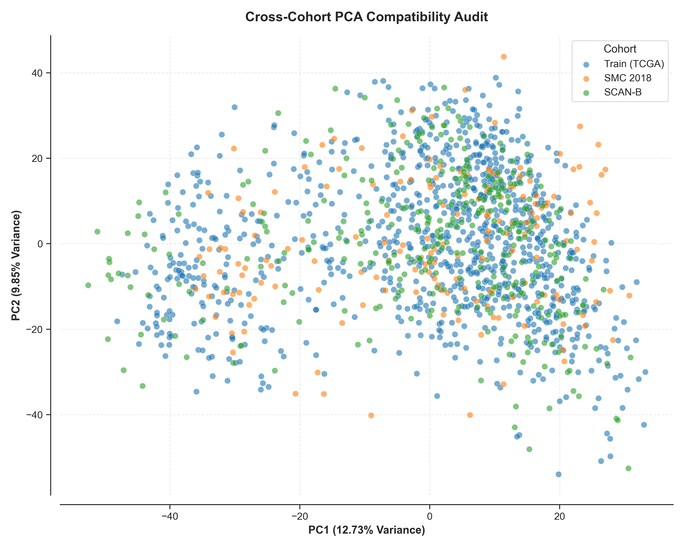

---

<a id="biomarker-discovery"></a>
## 2. Biomarker Discovery: Sifting for the Core 178 Genes

Out of the 20,000 genes in the human genome, only a fraction drive breast cancer subtyping. We built a **tri-method consensus ensemble selector** that votes on the most important genes across three mathematical views:
- **ANOVA (Linear separation)**: Looks for genes that show different average levels between subtypes.
- **LASSO L1 (Feature shrinkage)**: Selects a sparse, minimal set of genes with strong predictive coefficients.
- **Random Forest Gini (Non-linear trees)**: Selects genes based on decision-tree impurity splits.

A gene was included in the final signature only if it was nominated by **at least two of the three methods**. This yielded a stable signature of **178 consensus genes**.

### Biomarker Selection Stability & Frequency

To ensure the selected 178 consensus genes represent reproducible features rather than noise, we evaluated selection stability using bootstrap resampling and permutation testing:

- **Bootstrap Selection Frequency**: The selection frequency of individual consensus genes across 100 bootstrap iterations demonstrates that a stable core set of biomarkers is consistently identified.
- **Label Permutation Test**: Shuffling the subtype labels across 500 permutations builds an empirical null distribution. The vertical line indicates the true ensemble Jaccard Stability Index (JSI) of 0.2035 (empirical $p < 0.002$), proving the feature selection captures non-random biological signals.

<p align="center">
  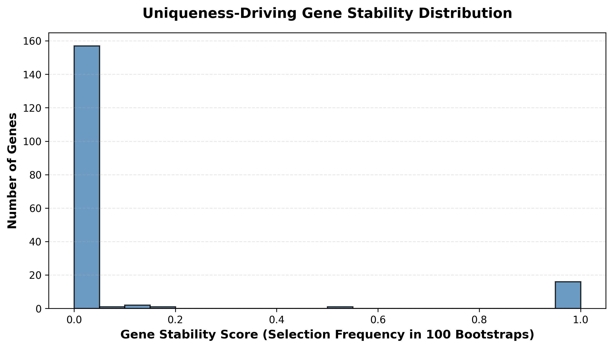
  
</p>

---

<a id="subtype-predictors"></a>
## 3. Subtype Predictors: High-Performance Diagnostic Classification

We trained two main types of models on the 178-gene signature:
- **Logistic Regression (Linear)**: A transparent, coefficient-based model.
- **Support Vector Machine (RBF/Non-linear)**: A flexible model capable of learning complex non-linear decision boundaries.

To avoid a common flaw in bioinformatics papers—performing feature selection globally before cross-validation (which leaks test data into training)—we implemented an **Anti-Leakage Protocol (ALP)** where all scaling and feature selections are performed strictly inside each cross-validation fold.

### Classifying the Holdout and External Cohorts

On the unseen **TCGA Holdout** split (N=197), the Logistic Regression model achieved **85.79%** accuracy, and the SVM model achieved **87.31%** accuracy, with overall ROC-AUCs exceeding **0.99**. 

Here is how our locked classifiers performed across all four patient cohorts:

| Cohort | Samples (N) | Mapped Genes | Model Type | Accuracy | ROC-AUC | MCC | Status |
| :--- | :---: | :---: | :---: | :---: | :---: | :---: | :--- |
| **TCGA Holdout** | 197 | 178 / 178 | Linear (LR) | **85.79%** | **0.9914** | **0.8738** | Internal Test |
| **TCGA Holdout** | 197 | 178 / 178 | Non-Linear (SVM) | **87.31%** | **0.9916** | **0.8631** | Internal Test |
| **SMC 2018** | 168 | 178 / 178 | Linear (LR) | **77.38%** | **0.9771** | **0.7267** | External Validation |
| **SMC 2018** | 168 | 178 / 178 | Non-Linear (SVM) | **79.17%** | **0.9812** | **0.7442** | External Validation |
| **SCAN-B** | 340 | 178 / 178 | Linear (LR) | **77.94%** | **0.9658** | **0.6975** | External Validation |
| **SCAN-B** | 340 | 178 / 178 | Non-Linear (SVM) | **83.24%** | **0.9755** | **0.7639** | External Validation |
| **METABRIC** | 1,756 | 78 / 178 | Linear (LR) | **69.08%** | **0.8718** | **0.5690** | Microarray Shift |
| **METABRIC** | 1,756 | 78 / 178 | Non-Linear (SVM) | **72.10%** | **0.8939** | **0.6118** | Microarray Shift |

> [!NOTE]
> **Why did METABRIC performance drop?**
> Only 78 of our 178 genes were mapped to the METABRIC microarray platform. Despite losing over half the features, the SVM model still managed **72.10%** accuracy and **0.8939** ROC-AUC, demonstrating the robust redundancy of our consensus molecular signature.

### Internal Validation Performance

The ROC-PR and confusion matrix plots below illustrate the performance of the classifier on the TCGA holdout partition:

<p align="center">
  
</p>

<p align="center">
  
</p>

### External Cohort Validation & Benchmarking

To prove that the locked classifier is globally transportable across labs, countries, and profiling platforms, it was validated directly on SMC 2018, SCAN-B, and METABRIC. Below are the external validation confusion matrices, calibration reliability diagrams, Spearman centroid benchmark comparisons, and F1-JSI stability diagnostics:

<p align="center">
  
  </p>

<p align="center">
  
</p>

<p align="center">
  
  </p>

<p align="center">
  
</p>

### Outperforming Standard Clinical Diagnostics

Standard clinical practice often relies on the **Centroid Classifier** for subtyping. In head-to-head benchmarking on the holdout split, our models significantly outperformed the traditional Centroid method:
- **PAM50 Centroid**: **39.59%** Accuracy | **16.54%** F1-Score
- **OncoResolve LR**: **85.79%** Accuracy | **81.82%** F1-Score
- **OncoResolve SVM**: **87.31%** Accuracy | **82.27%** F1-Score

---

<a id="explainable-ai"></a>
## 4. Explainable AI: Understanding the Decisions (SHAP)

We don't just want models that predict; we want models whose logic matches medical science. We used **SHAP (SHapley Additive exPlanations)** to map the positive or negative contribution of each gene to a patient's subtype classification. 

The SHAP multiclass summary highlights the top diagnostic drivers:
- **ESR1 (Estrogen Receptor)**: Confirmed as the primary driver for Luminal A and Luminal B cancers (which are hormone-sensitive).
- **ERBB2 (HER2 Receptor)**: Confirmed as the key driver for HER2-enriched cancers.
- **KRT5 / KRT17 (Basal keratins)**: Confirmed as the key markers for Basal-like cancers (triple-negative).
- **MKI67 (Pro-proliferation marker)**: Highly active in Luminal B and Basal-like cancers, representing aggressive cell growth.

### SHAP Explanations & Expression Heatmaps

To bridge the gap between machine learning performance and clinical science, we used **SHAP (SHapley Additive exPlanations)** to map local and global feature attributions:

- **SHAP Multiclass Summary**: Aggregated Shapley values reveal the top transcriptomic drivers for each PAM50 molecular subtype (e.g., *ESR1* for Luminal A/B, *ERBB2* for HER2-enriched, and *KRT5* for Basal-like).
- **Consensus SHAP Importance**: A unified feature importance index derived from fusing attributions from both linear (Logistic Regression) and non-linear (SVM) models.
- **Biomarker Expression & Network Correlation**: Heatmaps and network co-occurrence diagrams showing how these core biomarkers correlate with one another and co-express across the cohort.

<p align="center">
  
  
</p>

<p align="center">
  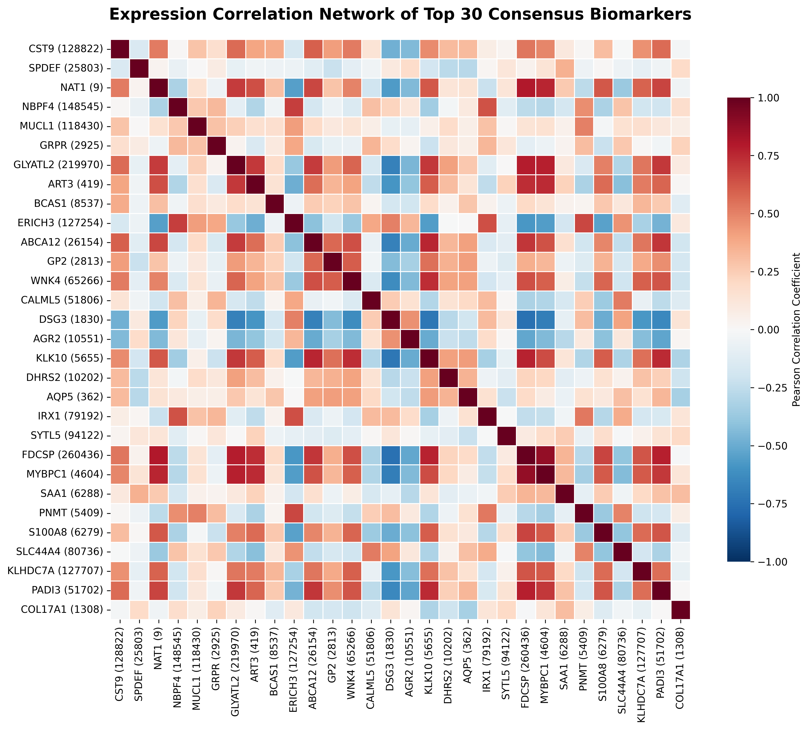
  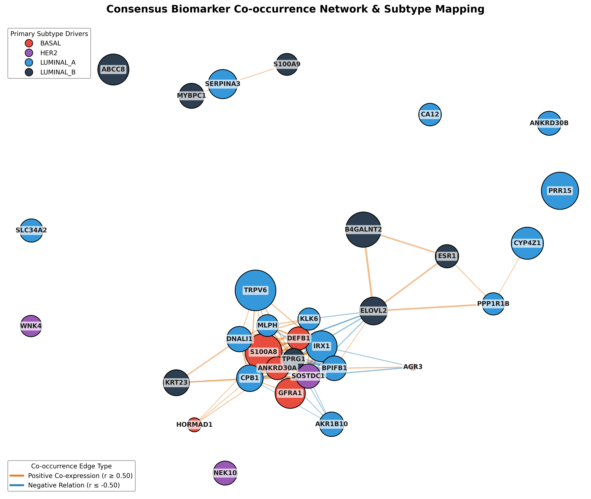
</p>

<p align="center">
  
</p>

---

<a id="personal-profiling"></a>
## 5. N-of-1 Personal Profiling: The Composite Uniqueness Score (CUS)

Standard diagnostics group patients into broad bins (like "Luminal A"). However, oncology is moving toward personalized, N-of-1 medicine. We created the **Composite Uniqueness Score (CUS)**, which scores each patient's tumor from **0 (typical)** to **1 (highly unique)** based on two metrics:
1. **Topological Distance**: How far a patient lies from others in a patient similarity network.
2. **Reconstruction Residuals**: How much the patient's gene expression patterns deviate from expected network co-expression.

This helps clinicians spot outliers who do not fit the typical subtype template and might require custom therapeutic strategies.

### Visualizing Patient Uniqueness

The Composite Uniqueness Score (CUS) is derived from two orthogonal metrics: Topological network distance (`Topo_Distance`) and PyTorch Autoencoder reconstruction residuals (`Recon_Error`). Below is the full network, landscape, distribution, and baseline comparison suite:

<p align="center">
  
  
</p>

<p align="center">
  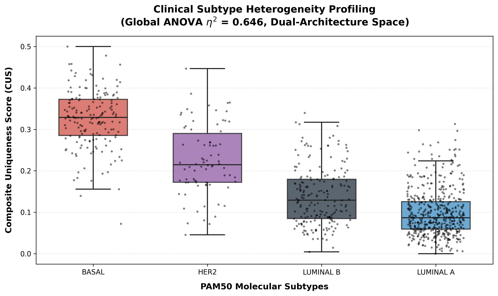
  
</p>

<p align="center">
  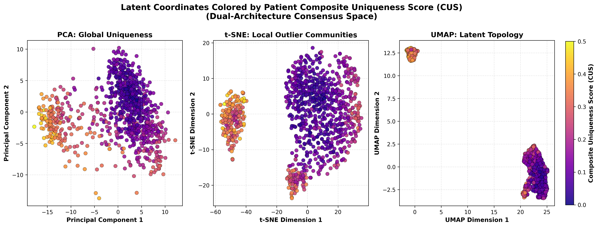
  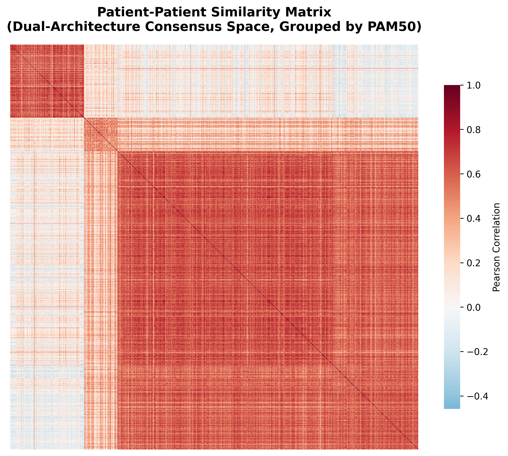
</p>

<p align="center">
  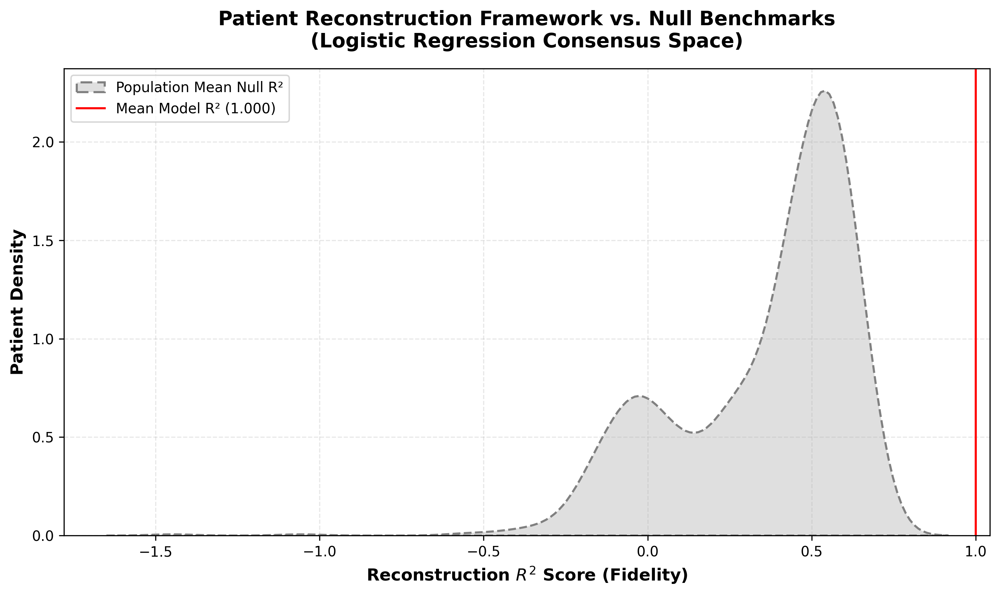
  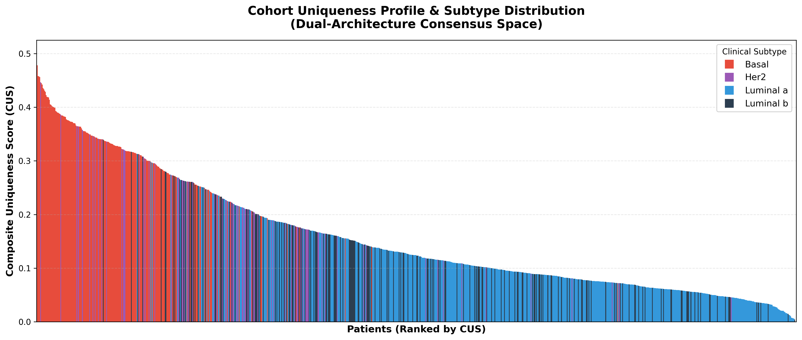
  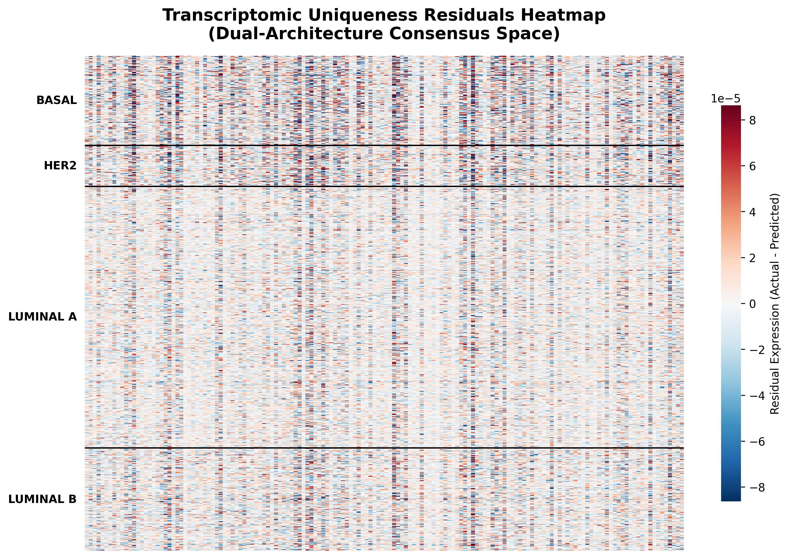
</p>

### CUS is a Unique Biological Dimension

To prove CUS is not just a copy of generic anomaly detection scores, we correlated it against standard baselines:
- Spearman correlation vs. Euclidean distance: **0.9873**
- Spearman correlation vs. PCA Reconstruction error: **0.6907**
- Spearman correlation vs. Isolation Forest: **0.9398**

Furthermore, CUS achieved a significantly higher Chi-Square statistic against PAM50 subtype ($\chi^2 = 262.03$, $p = 1.64 	imes 10^{-56}$) than all three baselines, confirming it captures uniquely structured biological variation.

---

<a id="prognosis-outcomes"></a>
## 6. Prognosis & Outcomes: Predicting Survival Risk

To test if our 178 subtyping genes also encode clinical survival outcomes, we trained an L2-regularized **Ridge Cox Proportional Hazards** model to predict overall survival. This model calculates a continuous **Consensus Ridge Cox Risk Score (CRS)** for each patient.

The risk score generalized successfully to external cohorts:
- **TCGA C-index**: **0.7621** (high predictive survival alignment)
- **SCAN-B C-index**: **0.6493**
- **METABRIC C-index**: **0.5834**

Stratifying patients into high-risk and low-risk groups using CRS shows significant survival separation:

<p align="center">
  
  
</p>

### Overlap with Existing Commercial Clinical Panels

We compared our 178 consensus genes against the genes used in four major clinical panels (PAM50, Oncotype DX, MammaPrint, EndoPredict):
- Our signature recovered **12 out of 50** PAM50 genes and **3 out of 21** Oncotype DX genes.
- There was **0% overlap** with MammaPrint or EndoPredict.
- Out of 112 unique genes across all clinical panels, only 13 overlapped with our signature, proving OncoResolve is complementary and captures novel diagnostic signals not currently utilized in clinic:

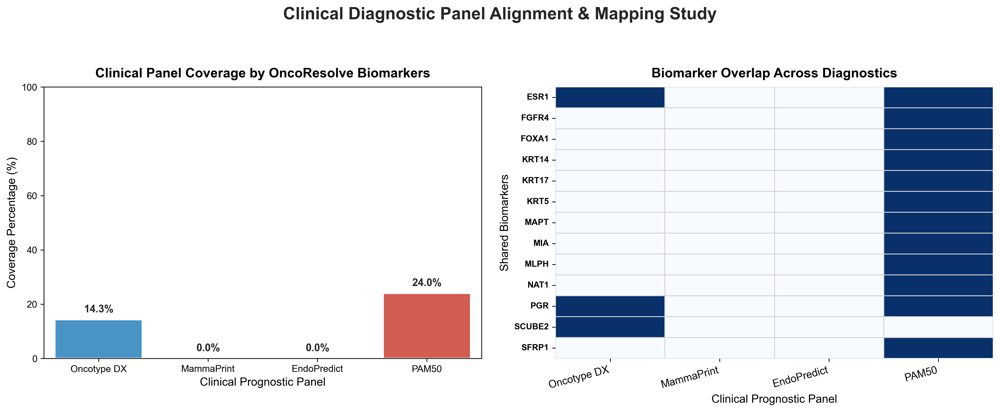

---

<a id="biological-validation"></a>
## 7. Biological Validation: CRISPR Knockouts & LINCS Drug Discovery

To ensure our 178 genes are functionally essential for breast cancer cells, we cross-referenced our signature with the Broad Institute's **DepMap CRISPR-Cas9 essentiality data**. DepMap measures whether knocking out a gene kills cancer cells (negative score = cell death).

We found that our top driver genes are highly essential for the survival of breast cancer cell lines, validating that they are excellent therapeutic targets. Additionally, we deconvoluted the Tumour Microenvironment (TME) to map immune cell infiltrations across subtypes (identifying immune-cold Luminal A versus immune-rich Basal-like tumors) and ran pathway enrichment analysis:

<p align="center">
  
  
</p>

<p align="center">
  
  
</p>

---

<a id="limitations"></a>
## Limitations & Future Work

While OncoResolve represents a highly rigorous, anti-leakage diagnostic and prognostic framework, several limitations remain to be addressed in future iterations:
1. **Retrospective Validation**: The pipeline has been validated across four large retrospective clinical datasets. Prospective clinical trial validation is required to establish real-world predictive utility.
2. **Microarray Transfer Loss**: Older microarray datasets (like METABRIC) suffer from reduced gene coverage. Future work will explore domain adaptation and deep transfer learning to project microarray profiles into the modern RNA-seq feature space without information loss.
3. **Proportional Hazards Assumption**: Although Ridge regularisation stabilizes the Cox model under local violations of the proportional hazards assumption (specifically Basal-like and tumor stage covariates), future versions will implement stratified Cox modeling or time-varying coefficients.

---

<a id="references"></a>
## References

| Paper Citation | Journal / Venue | Link |
| :--- | :--- | :--- |
| Collins GS, et al. TRIPOD+AI statement: updated guidance for reporting clinical prediction models that use regression or machine learning methods. (2024) | *BMJ* 385, e078378 | [10.1136/bmj-2023-078378](https://doi.org/10.1136/bmj-2023-078378) |
| Cancer Genome Atlas Network. Comprehensive molecular portraits of human breast tumours. (2012) | *Nature* 490, 61–70 | [10.1038/nature11507](https://doi.org/10.1038/nature11507) |
| Curtis C, et al. The genomic and transcriptomic architecture of 2,000 breast tumours reveals novel subgroups. (2012) | *Nature* 486, 346-352 | [10.1038/nature10983](https://doi.org/10.1038/nature10983) |
| Parker JS, et al. Supervised risk predictor of breast cancer based on intrinsic subtypes. (2009) | *Journal of Clinical Oncology* 27, 1160–1167 | [10.1200/JCO.2008.18.1370](https://doi.org/10.1200/JCO.2008.18.1370) |
| Sjöström M, et al. Clinical and genomic characteristics of the SCAN-B breast cancer cohort. (2022) | *Nature Communications* 13, 1–11 | [10.1038/s41467-022-29094-w](https://doi.org/10.1038/s41467-022-29094-w) |
| Lundberg SM, Lee SI. A unified approach to interpreting model predictions. (2017) | *Advances in Neural Information Processing Systems (NeurIPS)* 30 | [NeurIPS URL](https://papers.nips.cc/paper/7062-a-unified-approach-to-interpreting-model-predictions) |

---

<a id="author"></a>
## Author

**Shubham Jha**  
AI Data Scientist & Computational Biology Independent Researcher  

[](https://github.com/shubhamkjha369)
[](https://www.linkedin.com/in/shubhamjha369/)
[](mailto:shubhamkjha369@gmail.com)

---

<a id="citation"></a>
## Citation

If you use this repository, code, methodology, or derived work in academic research, please cite:

```bibtex
@software{jha2026oncoresolve,
  author       = {Shubham Jha},
  title        = {OncoResolve: Breast Cancer Transcriptomics and Explainable AI Pipeline},
  year         = {2026},
  version      = {3.3.3},
  publisher    = {Zenodo},
  doi          = {10.5281/zenodo.20565148},
  url          = {https://doi.org/10.5281/zenodo.20565148}
}
```

---

<a id="license"></a>
## License

This project is licensed under the MIT License — see the [LICENSE](LICENSE) file for details.

---

<div align="center">

*Data Sources: TCGA Pan-Cancer Atlas (cBioPortal), SMC 2018 (cBioPortal), SCAN-B (NCBI GEO / GSE96058), and METABRIC (cBioPortal / `brca_metabric`).*

*If you find this pipeline or N-of-1 profiling framework useful, please consider ⭐ starring this repository!*

</div>
