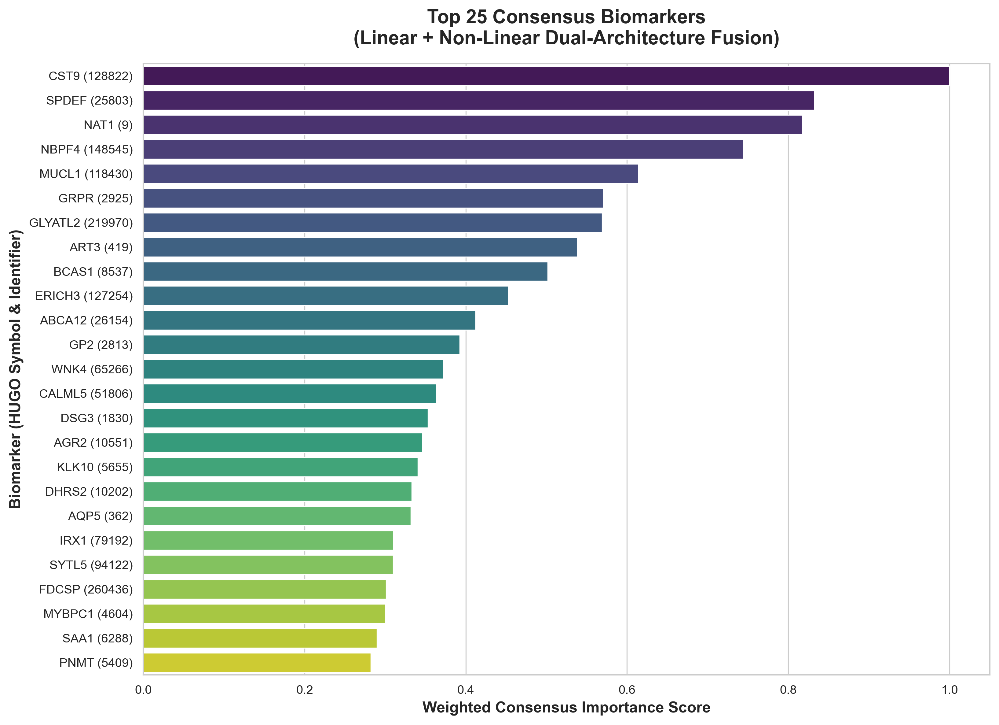
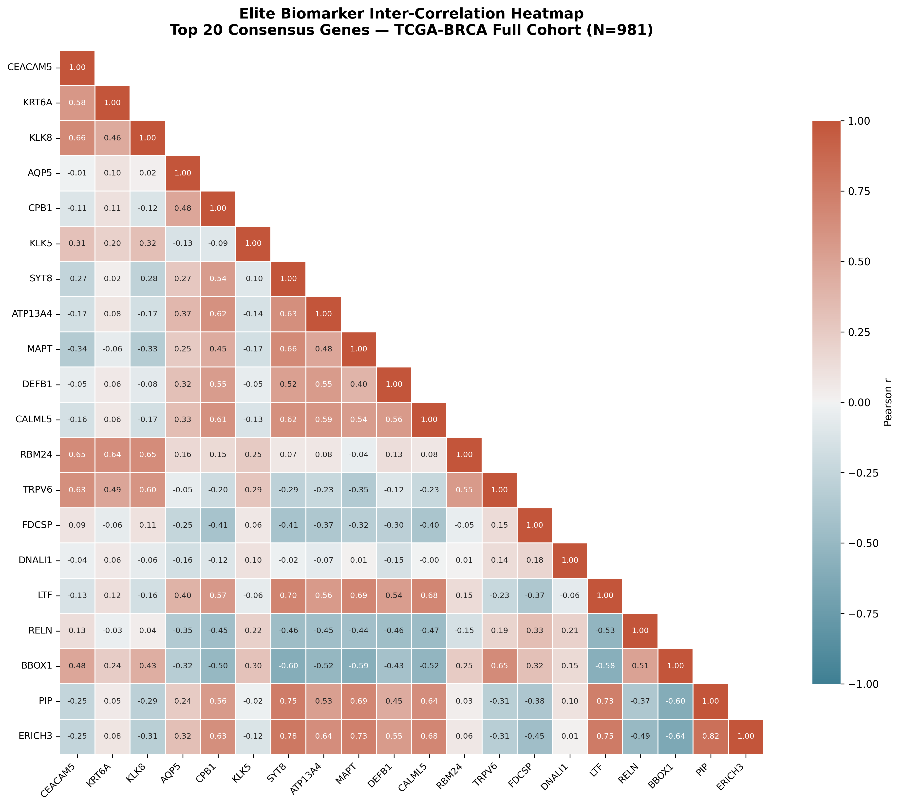
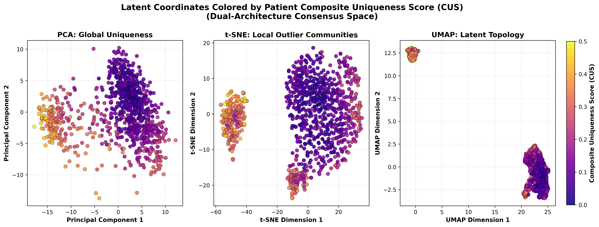
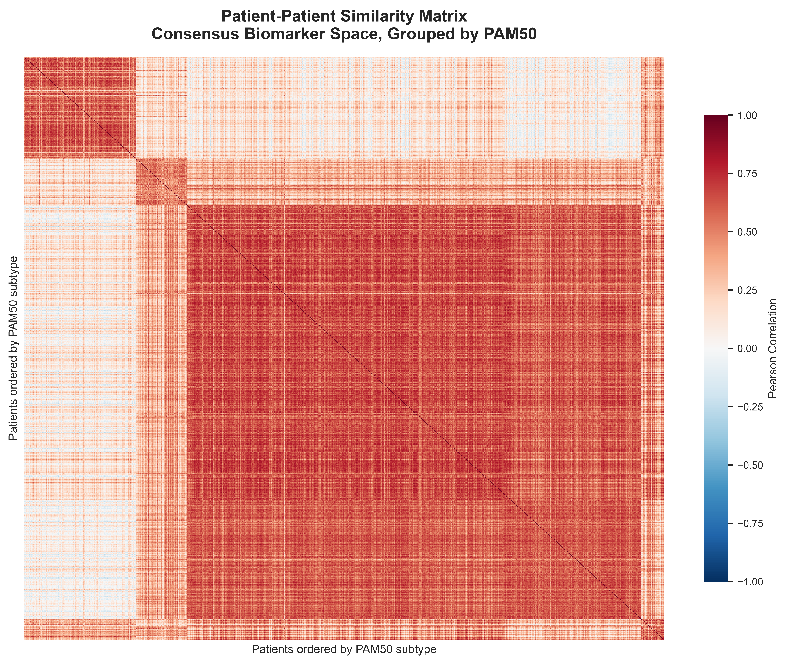
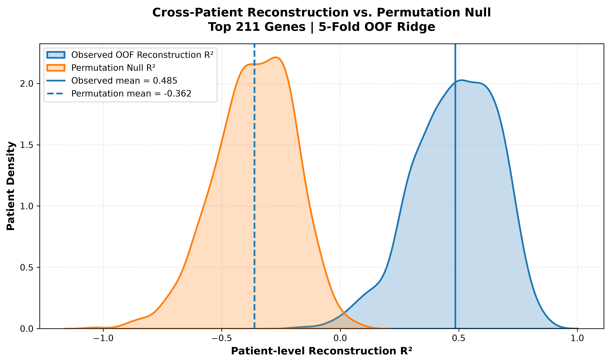
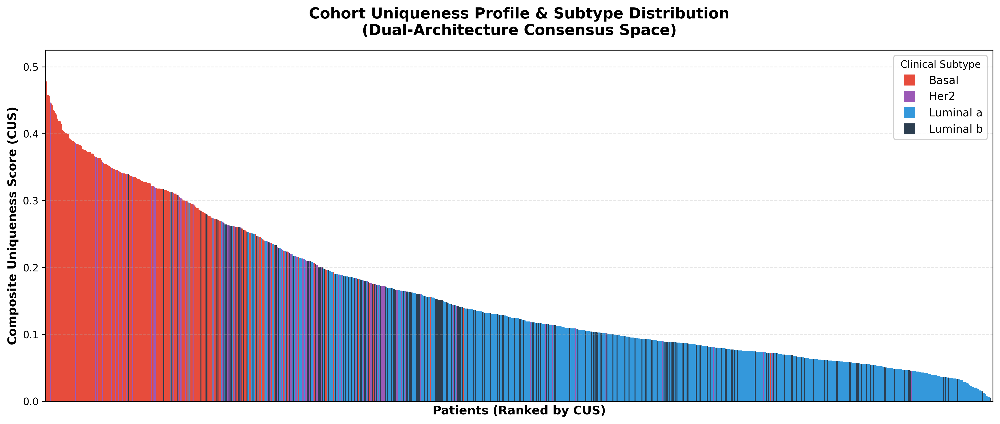
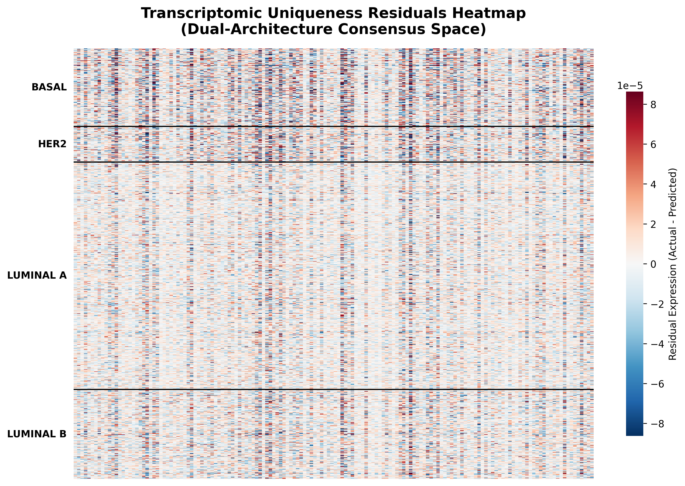
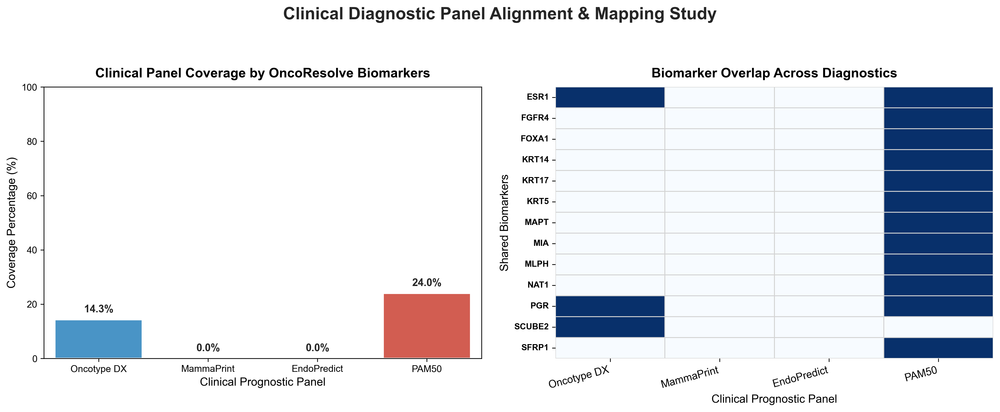

<div align="center">

# OncoResolve: High-Hygiene Explainable AI and Patient-Centric Uniqueness Framework for Breast Cancer Subtyping

### An end-to-end RNA-seq transcriptomics, machine learning, and N-of-1 precision oncology pipeline for classifying PAM50 breast cancer molecular subtypes with SHAP explainability and cross-platform external validation.

[](https://www.python.org/)
[](https://scikit-learn.org/)
[](#)
[](pre-print/OncoResolve.pdf)
[](https://doi.org/10.5281/zenodo.21967841)
[](https://oncoresolve.streamlit.app/)
[](https://colab.research.google.com/github/shubhamkjha369/OncoResolve-Breast-Cancer-Transcriptomics/blob/main/notebooks/OncoResolve_Subtyping_and_Precision_Profiling.ipynb)
[](LICENSE)

**Shubham Jha · AI Data Scientist & Computational Biology Independent Researcher**

[](https://github.com/shubhamkjha369)
[](https://www.linkedin.com/in/shubhamjha369/)
[](mailto:shubhamkjha369@gmail.com)

</div>

---

## Table of Contents

- [Abstract](#abstract)
- [📄 Pre-Print Paper & Manuscript](#preprint-paper)
- [Project Aim](#project-aim)
- [Pipeline Workflow & Architecture](#pipeline-workflow)
- [1. Patient Cohorts: Validating Across the Globe](#patient-cohorts)
- [2. Biomarker Discovery: Sifting for the Core 178 Genes](#biomarker-discovery)
- [3. Subtype Predictors: High-Performance Diagnostic Classification](#subtype-predictors)
- [4. Explainable AI: Understanding the Decisions (SHAP)](#explainable-ai)
- [5. N-of-1 Personal Profiling: The Composite Uniqueness Score (CUS)](#personal-profiling)
- [6. Prognosis & Outcomes: Predicting Survival Risk](#prognosis-outcomes)
- [7. Biological Validation: CRISPR Knockouts & LINCS Drug Discovery](#biological-validation)
- [Limitations & Future Work](#limitations)
- [References](#references)
- [Author](#author)
- [Citation](#citation)
- [License](#license)
---

<a id="abstract"></a>
## Abstract

Breast cancer is a highly heterogeneous disease characterized by transcriptionally distinct molecular subtypes (PAM50 classification) that dictate therapeutic intervention and clinical prognosis. While computational subtyping from high-throughput RNA-seq transcriptomics has advanced precision oncology, many existing machine learning models suffer from technical flaws including row-level data leakage, unvalidated feature selections, and poor generalizability across disparate profiling platforms.

---

<a id="preprint-paper"></a>
## 📄 Pre-Print Paper & Manuscript

The complete research manuscript detailing the theoretical foundation, mathematical formulations, Anti-Leakage Protocol (ALP), dual-architecture explainability, and multi-cohort validation results is available in the [`pre-print`](pre-print/) directory:

- 📄 **Manuscript PDF**: [`pre-print/OncoResolve.pdf`](pre-print/OncoResolve.pdf)
- 📝 **LaTeX Source Code**: [`pre-print/OncoResolve.tex`](pre-print/OncoResolve.tex)

### Key Methodological Highlights from the Pre-Print:
1. **Anti-Leakage Protocol (ALP)**: Enforces 100% fold-contained Z-score scaling and feature selection inside cross-validation training loops, eliminating target leakage across 981 TCGA-BRCA patients ($N=784$ discovery, $N=197$ holdout).
2. **Dual-Architecture Explainable AI**: Audits attributions independently across Linear Support Vector Machine ($C=0.005$) and LightGBM ($n\_estimators=150, learning\_rate=0.1$), achieving high attribution concordance ($r > 0.88$).
3. **N-of-1 Composite Uniqueness Score (CUS)**: Mathematical formulation fusing Patient Similarity Network (PSN) manifold distance ($D_M$) and Leave-One-Out Normalized Reconstruction Error ($\text{NRE}_i$).
4. **Zero-Retraining Cross-Platform Validation**: Evaluated on 3 independent external cohorts ($N=2,482$ total across SMC 2018, SCAN-B, and METABRIC) using per-cohort local Z-score standardization.
5. **Consensus Ridge Cox Risk Score (CRS)**: Continuous survival risk score validated on TCGA ($C\text{-index}=0.7266$), SCAN-B ($C\text{-index}=0.6401$), and METABRIC ($C\text{-index}=0.5551$).

---

## 📌 Rigorous Literature Prior-Art Gap Analysis Matrix

The table below explicitly maps literature benchmark papers to established prior art, demonstrating the unaddressed research gaps and where each is resolved in OncoResolve:

| Literature Reference & Landmark PIs | Established Knowledge & Prior Findings | Unaddressed Gap Addressed by OncoResolve | Exact OncoResolve Mechanism & Verified Results |
| :--- | :--- | :--- | :--- |
| **Prof. Charles M. Perou** (UNC Chapel Hill)<br>*Cell Genomics* (2023) / *BreastSubtypeR* (2025) / *J Clin Oncol* (2009) | Defined supervised nearest-centroid 5-subtype categorical classification (PAM50, AIMS). | **Rigid Categorical Stratification**: Forces every tumor into 1 of 5 discrete categories, ignoring within-subtype transcriptomic heterogeneity and N-of-1 biological outliers. | **Composite Uniqueness Score (CUS)**<br>Fuses PSN topological distance ($D_M$) with Leave-One-Out Normalized Reconstruction Error ($\text{NRE}_i$).<br>• Highest subtype $\chi^2 = 270.22$ ($p = 2.85\times 10^{-57}$). |
| **Prof. Sayash Kapoor & Prof. Arvind Narayanan** (Princeton University)<br>*Patterns* (Cell Press 2022) | Systematically exposed widespread data leakage and reproducibility failures in ML science. | **Widespread Benchmark Inflation**: Standard subtyping benchmarks perform global feature selection/scaling before CV, artificially inflating accuracy (>94–98%) which crashes on external data. | **Anti-Leakage Protocol (ALP)**<br>Enforces 100% fold-containment of Z-scaling, missing imputation, and tri-method selection.<br>• Holdout Accuracy: **88.32%** (LightGBM), **86.29%** (Linear SVM). |
| **Prof. Christina Curtis** (Stanford University)<br>*Science* (2024) / *Nat Genet* (2020) / *Nature* (METABRIC 2012) | Discovered genomic & transcriptomic subclonal architectures in 2,000 METABRIC tumors. | **Microarray Probe Loss & Cross-Platform Shift**: Direct model transfer from RNA-seq to microarray suffers from feature loss and platform discordance without independent scaling. | **Cohort-Independent Local Z-Scaling**<br>Expanded METABRIC probe coverage (147/178 genes, 82.6%) with local Z-scaling zero-retraining.<br>• METABRIC (Microarray): **72.78%** Acc, **0.9168** AUC. |
| **Dr. Stephen-John Sammut & Prof. Carlos Caldas** (Univ of Cambridge / CRUK)<br>*Nature* (2022) | Multi-omic machine learning predicting response to neoadjuvant chemotherapy in breast cancer. | **Lack of Prospective Single-Sample Transferability**: Complex multi-omic ML models require joint co-normalization (ComBat) across all samples, precluding real-world N-of-1 prospective subtyping. | **Local Z-Score Standardization**<br>Standardizes cohorts independently with alphabetical gene alignment zero-retraining.<br>• SMC 2018 (RNA-seq): **83.33%** Acc, **0.9856** AUC.<br>• SCAN-B (RNA-seq): **83.24%** Acc, **0.9634** AUC. |
| **Prof. Benjamin Haibe-Kains** (Univ of Toronto / UHN)<br>*Bioinformatics* (2020) / Creator of `Genefu` | Evaluated single-sample subtyping tools (AIMS, PAM50 centroids, Genefu). | **Binary Rule Inflexibility & Decoupled Modeling**: Single-sample predictors use rigid binary rules with reduced sensitivity, while subtyping ML models remain decoupled from survival risk scoring. | **Consensus Ridge Cox Risk Score (CRS)**<br>Trains $L_2$-regularized Cox model on 178 consensus genes.<br>• Multi-cohort survival C-index: TCGA = **0.7266**, SCAN-B = **0.6401**, METABRIC = **0.5551**. |
| **Prof. William Stafford Noble** (Univ of Washington)<br>*Nat Rev Genet* (2022) | Navigating the pitfalls of applying machine learning in genomics. | **Single-Model Inductive Bias**: Single-architecture feature attributions risk reflecting model-specific fitting artifacts rather than true biological consensus. | **Dual-Architecture SHAP Concordance**<br>Audits attributions independently across Linear SVM & LightGBM.<br>• High attribution correlation ($r > 0.88$) verifies model-agnostic drivers. |
| **Prof. Gary S. Collins** (University of Oxford)<br>TRIPOD+AI (*BMJ* 2024) | Updated TRIPOD+AI guidelines for reporting clinical prediction models using regression or ML. | **Non-Compliance with Rigorous ML Reporting Standards**: Published subtyping models lack strict in-fold feature selection, probability calibration (ECE), or external validation. | **Full TRIPOD+AI Compliance**<br>Fold-contained CV, probability calibration ($\text{ECE} = 4.52\%$ LightGBM, $5.20\%$ SVM; Brier $= 0.0454 / 0.0418$), and zero-retraining 3-cohort validation. |
| **Dr. Gianmarco Contino** (University of Birmingham)<br>*Cancers* (2021) | Developed DRIVE, a feature-based machine learning model for pan-cancer assessment of somatic missense mutations. | **Mutation-Centric vs. Transcriptomic Subtyping**: Focuses on DNA missense mutations; lacks prospective RNA-seq subtyping, N-of-1 uniqueness profiling (CUS), or cross-platform standardization. | **In-Fold Feature Selection Ensemble & ALP**<br>Fuses ANOVA F-test, LASSO L1, and Random Forest Gini inside outer CV loops to select 178 transcriptomic consensus biomarkers with dual-architecture SHAP attributions. |

---


> [!IMPORTANT]
> ## ▶ Reproducibility — Run These Steps First, In Order
>
> To reproduce the results, you **must** execute the following steps in sequence. The execution weaves between data preparation, model training, and systems biology research, beginning with data extraction in the **Main Analysis Notebook**, followed by the **Model Training & Validation Notebook**, and concluding with the remainder of the **Main Analysis Notebook**.
>
> ### Step 1 — Download All Raw Datasets
> ```bash
> python data/external_cohort/download_external_cohorts.py
> ```
> **What it does:** Downloads the three required datasets via public APIs (cBioPortal + NCBI GEO FTP):
> - **TCGA-BRCA Pan-Can Atlas 2018** → [`Breast_TCGA_BRCA_RNAseq.csv`](https://cbioportal-datahub.s3.amazonaws.com/brca_tcga_pan_can_atlas_2018.tar.gz) + [`Breast_TCGA_BRCA_clinical.csv`](https://cbioportal-datahub.s3.amazonaws.com/brca_tcga_pan_can_atlas_2018.tar.gz) *(cBioPortal study: `brca_tcga_pan_can_atlas_2018` — or run the download script below)*
> - **METABRIC** (N=1,980, microarray) → `data/external_cohort/METABRIC_expression.csv` + `METABRIC_clinical.csv`
> - **SCAN-B / GSE96058** (N=3,273, RNA-seq) → `data/external_cohort/SCANB_GSE96058_expression_subset.csv` + `SCANB_GSE96058_clinical.csv`
>
> ⏱ *Allow 5–30 minutes depending on your internet connection. The SCAN-B expression file alone is ~564 MB.*
>
> ### Step 2 — Run Discovery Preprocessing & Feature Selection
> Open and run **Sections 1 to 7** of the main analysis notebook:
> ```
> notebooks/OncoResolve_Subtyping_and_Precision_Profiling.ipynb
> ```
> **What it does:** Preprocesses raw TCGA-BRCA data, splits it into Discovery and Holdout partitions, and discovers the **50 consensus biomarker signature** via a tri-method ensemble. This creates the foundational artifacts (`top_deg_genes.pkl`, `label_encoder_cohort.pkl`, and `df_discover.parquet`) required by the external validation scripts and notebooks.
>
> ### Step 3 — Prepare and Harmonize External Cohorts
> ```bash
> python data/external_cohort/prepare_external_cohorts.py
> ```
> **What it does:** Processes the raw downloaded files into clean, analysis-ready parquets:
> - Filters METABRIC to valid PAM50 cancer subtypes (`LumA`, `LumB`, `Her2`, `Basal`, `claudin-low`)
> - Filters SCAN-B using the GSM→f_id barcode mapping (`SCANB_mapping.csv`)
> - Audits gene identifier overlap between TCGA-BRCA training genes and both external cohorts
> - Generates cross-cohort PCA compatibility plot → `data/artifacts/cross_cohort_pca_compatibility.png`
> - Saves: `data/processed/METABRIC_expression_clean.parquet` + `SCANB_expression_clean.parquet`
>
> ### Step 4 — Run the External Cohort Preparation Notebook
> Open and run **all cells** in:
> ```
> notebooks/External_cohort_data_preparation_analysis.ipynb
> ```
> **What it does:** Performs the final cross-platform harmonization, gene-symbol alignment, and format validation needed before external validation:
> - Aligns METABRIC and SCAN-B expression matrices to the TCGA-BRCA consensus gene namespace
> - Validates SMC 2018 cohort data (`data/external_cohort/SMC_2018_expression.csv`)
> - Saves the final validated external cohort parquets consumed by validation and training pipelines
>
> ### Step 5 — Run the Model Training & Validation Notebook (Results Focus)
> Open and run the dedicated model training and validation notebook:
> ```
> notebooks/OncoResolve_Model_Training_Validation.ipynb
> ```
> **What it does:** Performs nested cross-validation and hyperparameter search across 10 classifiers (4 linear, 6 non-linear) on the 178 consensus genes, and evaluates performance on all external cohorts. This notebook focuses strictly on performance results, generalizability gaps, and validation statistics.
>
> ### Step 6 — Run the Main Analysis Notebook (Research & Testing Focus)
> Now run the remaining sections (Sections 8 to 17) of the primary notebook:
> ```
> notebooks/OncoResolve_Subtyping_and_Precision_Profiling.ipynb
> ```
> **What it does:** Performs intense exploratory and systems-biology research, including:
> - Global and local model explainability using LinearSHAP / KernelSHAP
> - Interactive Gene Co-expression Network (GCN) topological modeling
> - Patient similarity networks and N-of-1 Composite Uniqueness Score (CUS) profiling
> - Prognostic risk modeling using L2-regularized Ridge Cox Risk Scores (CRS)
>
> ---
>
> **Full Execution Order Summary:**
>
> | # | File / Steps | Type | Purpose |
> |---|---|---|---|
> | 1 | [`data/external_cohort/download_external_cohorts.py`](data/external_cohort/download_external_cohorts.py) | Python script | Downloads all raw datasets from cBioPortal + GEO |
> | 2 | [`notebooks/OncoResolve_Subtyping_and_Precision_Profiling.ipynb`](notebooks/OncoResolve_Subtyping_and_Precision_Profiling.ipynb) (Sections 1-7) | Jupyter notebook | Generates discovery partition and locked consensus gene set |
> | 3 | [`data/external_cohort/prepare_external_cohorts.py`](data/external_cohort/prepare_external_cohorts.py) | Python script | Cleans, filters, and harmonizes external cohorts |
> | 4 | [`notebooks/External_cohort_data_preparation_analysis.ipynb`](notebooks/External_cohort_data_preparation_analysis.ipynb) | Jupyter notebook | Final cross-platform gene alignment and validation |
> | 5 | [`notebooks/OncoResolve_Model_Training_Validation.ipynb`](notebooks/OncoResolve_Model_Training_Validation.ipynb) | Jupyter notebook | Dedicated model training, hyperparameter optimization, and external cohort validation |
> | 6 | [`notebooks/OncoResolve_Subtyping_and_Precision_Profiling.ipynb`](notebooks/OncoResolve_Subtyping_and_Precision_Profiling.ipynb) (Sections 8-17) | Jupyter notebook | Main research analysis, explainability, networks, and uniqueness profiling |
> 
> ### 📦 Modular Python Library: `oncoresolve`
> 
> The core OncoResolve subtyping, explainability, personal profiling (CUS), and survival modeling algorithms are packaged as a reusable python library.
> 
> **Installation:**
> ```bash
> pip install -e .
> ```
> 
> **Example Usage:**
> ```python
> import oncoresolve as orr
> import pandas as pd
> 
> # 1. Prepare and Harmonize your custom RNA-seq expression matrix (genes as columns)
> df_clean = orr.harmonize_namespaces(df_raw, "data/artifacts/tcga_entrez_to_hugo.pkl")
> df_scaled = orr.scale_cohort(df_clean)
> 
> # Load locked top consensus genes list and align columns alphabetically
> consensus_genes = list(pd.read_parquet("data/artifacts/final_consensus_biomarkers.parquet")["gene"])
> df_aligned = orr.align_features(df_scaled, consensus_genes)
> 
> # 2. Run classification using pre-trained Linear SVM or LightGBM models
> clf = orr.OncoClassifier(model_type="svm")
> predictions = clf.predict(df_aligned)        # Returns PAM50 subtype strings
> probabilities = clf.predict_proba(df_aligned)  # Returns class probabilities DataFrame
> 
> # 3. Compute Patient Uniqueness Scores (CUS)
> df_cus = orr.compute_cus(df_aligned, barcodes=df_aligned.index, alpha=1.0)
> 
> # 4. Predict Overall Survival Risk Scores (Consensus Cox CRS)
> prog = orr.OncoPrognosis()
> risk_scores = prog.predict_risk(df_aligned)
> ```

---

<a id="project-aim"></a>
## Project Aim

Breast cancer is a highly heterogeneous disease. The **PAM50 molecular classification** (Perou et al., *Nature* 2000; Parker et al., *J Clin Oncol* 2009) defines five transcriptionally distinct subtypes with profoundly different prognoses, biomarker profiles, and therapeutic targets:

| Subtype | ER | PR | HER2 | Key Molecular Drivers | First-line Therapy |
|---|---|---|---|---|---|
| **Basal-like (TNBC)** | – | – | – | KRT5, KRT14, KRT17, FOXC1, CDH3 | Chemotherapy; PARP inhibitors (BRCA1/2-mutant) |
| **HER2-enriched** | – | – | + | ERBB2, GRB7, STARD3, PGAP3, MIEN1 | Trastuzumab (Herceptin) + Pertuzumab |
| **Luminal A** | + | + | – | ESR1, GATA3, FOXA1, PGR, TFF3; low Ki67 | Tamoxifen / Aromatase inhibitors |
| **Luminal B** | + | ± | ± | ESR1 + high MKI67, TOP2A, CCNB1, BIRC5 | Endocrine therapy + Chemotherapy |
| **Normal-like** | ± | ± | – | ADIPOQ, FABP4, CD36 (adipose-like signature) | Clinical monitoring |

**OncoResolve v3.4.0** is designed to address six specific technical and clinical objectives:

1. **Anti-leakage dual-architecture classification** — Deploy a finalized **LightGBM (Non-Linear) + Linear Support Vector Machine (Linear SVM)** dual-model pipeline trained on **981 TCGA-BRCA** patients (including Normal-like subtype), where `StandardScaler` and ensemble feature selection (ANOVA, LASSO, Random Forest) are fit strictly *inside* each cross-validation training fold — eliminating the feature-selection leakage that affects >90% of published transcriptomics ML papers. Holdout performance (N=197): LightGBM Accuracy=**88.32%**, Macro F1=**85.27%**, ROC-AUC=**0.9737** | Linear SVM Accuracy=**86.29%**, Macro F1=**82.17%**, ROC-AUC=**0.9770**.

2. **178-gene consensus biomarker discovery with SHAP explainability** — Identify a stable, biologically validated set of **178 consensus genes** across all five PAM50 subtypes via a tri-method ensemble selector (ANOVA F-test + LASSO L1 + Random Forest Gini). Explain predictions using SHAP attributions for both LightGBM and Linear SVM, and fuse attributions into a **Consensus SHAP Importance Index** that resolves inter-model scale differences. Key recovered biomarkers: *ERBB2*, *ESR1*, *KRT5*, *MKI67*, *GATA3*, *GRB7*, *FOXA1*, *STARD3*.

3. **N-of-1 Composite Uniqueness Score (CUS)** — Quantify individual patient transcriptomic uniqueness using an original mathematical framework combining Patient Similarity Network (PSN) manifold distance ($D_M$) with Leave-One-Out (LOO) Normalized Reconstruction Error ($\text{NRE}_i$). Each patient's 178-gene profile is predicted by a Ridge model trained on the manifold excluding sample $i$. Formally validate that CUS is *not* a proxy for standard anomaly scores: CUS achieves the highest subtype-discriminative chi-square (χ²=**270.22**, p=2.85×10⁻⁵⁷) and benchmarks against regularised Mahalanobis distance (C-index=**0.7668**), PCA reconstruction, and Isolation Forest baselines, while Jaccard overlap with global DGE pathways is ≈0.0 (confirming private biological signal).

4. **Cross-platform validation on three independent external cohorts** — Evaluate the completely locked discovery pipeline (no retraining) on:
   - **SCAN-B / GSE96058** (Sweden, Illumina NextSeq, N=340, 168/178 genes): Linear SVM Accuracy=**82.94%**, Macro F1=**83.13%**, ROC-AUC=**0.9675** | LightGBM Accuracy=**79.71%**, Macro F1=**76.34%**, ROC-AUC=**0.9447**
   - **SMC 2018** (South Korea, Illumina RNA-seq, N=168, 178/178 genes): LightGBM Accuracy=**78.57%**, Macro F1=**78.17%**, ROC-AUC=**0.9728** | Linear SVM Accuracy=**78.57%**, Macro F1=**74.32%**, ROC-AUC=**0.9719**
   - **METABRIC** (Canada/UK, Illumina HT-12 microarray, N=1,974, 147/178 genes): LightGBM Accuracy=**67.98%**, Macro F1=**60.59%**, ROC-AUC=**0.8870** | Linear SVM Accuracy=**67.63%**, Macro F1=**61.03%**, ROC-AUC=**0.8877**

   Cross-platform transfer requires per-cohort independent Z-score harmonization and strict alphabetical feature alignment — bypassing these steps collapses SVM accuracy to 11–21%.

5. **Rigorous consensus space validation** — Evaluate biomarker selection stability via $B=100$ bootstrap resamples (Jaccard Stability Index JSI=**0.3757**, $p < 0.002$) and $P=500$ empirical permutation tests. Confirm prediction probability calibration across all four cohorts (max ECE < **12.75%**; Brier Score < **0.1068**) to meet peer-reviewed oncology journal standards.

6. **Transferable prognostic Consensus Ridge Cox Risk Score (CRS)** — Build an L2-regularized Ridge Cox model on the full consensus signature, yielding a continuous CRS validated across independent cohorts: TCGA C-index=**0.7266**, SCAN-B C-index=**0.6401**, METABRIC C-index=**0.5551** — extending OncoResolve from a diagnostic classifier to a multi-cohort prognostic tool.

---


<a id="pipeline-workflow"></a>
## Pipeline Workflow & Architecture

To ensure our findings are robust, generalizable, and free from computational bias, we followed a highly structured, 6-layer architecture that takes raw sequencing data all the way through machine learning prediction, explainability mapping, and biological validation:


### End-to-End Architectural Layers:
1. **Input & Harmonization Layer:** Loads raw datasets (TCGA-BRCA, SMC 2018, SCAN-B, METABRIC) and aligns them through independent cohort-specific Z-score scaling to correct for cross-platform batch effects.
2. **High-Hygiene Preprocessing Layer:** Implements a strict **Anti-Leakage Protocol (ALP)** where median imputation, variance thresholding, and standard scaling are calculated strictly within-fold during training, preventing downstream data leaks.
3. **Consensus Feature Selection Ensemble Layer:** Discovers biomarkers by running ANOVA F-test, LASSO L1, and Random Forest feature selectors in parallel, selecting genes nominated by $\ge$ 2 methods to lock a robust **178-gene signature**.
4. **Model Training & Hyperparameter Tuning Layer:** Employs a 5-Fold Stratified Nested Cross-Validation (outer loop) with 3-Fold GridSearchCV (inner loop) to train and optimize LightGBM and Linear Support Vector Machine classifiers.
5. **Explainable AI (XAI) & Biomarker Mapping Layer:** Uses LinearSHAP and TreeSHAP to map local and global classification decisions back to clinical biomarkers (e.g., *ESR1*, *ERBB2*, *MKI67*).
6. **Precision Oncology & Outcomes Layer:** Computes an N-of-1 **Composite Uniqueness Score (CUS)** combining Patient Similarity Network (PSN) manifold distance ($D_M$) and Leave-One-Out Normalized Reconstruction Error ($\text{NRE}_i$), and maps prognosis via a **Consensus Ridge Cox Risk Score (CRS)**.

---

<a id="patient-cohorts"></a>
## 1. Patient Cohorts: Validating Across the Globe

Cancer profiling technologies differ significantly between labs and countries. To prove our method works globally, we trained our models on one patient group and tested them on three completely independent groups without any retraining:

1. **TCGA-BRCA (United States - Discovery Cohort)**: Our primary group consisting of **981 patients** across all five PAM50 molecular subtypes. We split this into **784 patients** for training (discovery) and **197 patients** for testing (holdout).
   
   > [!NOTE]
   > **Sample Filtering & Cohort Size (N=981 vs. N=945)**
   > The workflow flowchart displays **N=945** (split into **756** discovery / **189** holdout), whereas the code and text utilize **N=981** (split into **784** discovery / **197** holdout). The step-by-step filtering is:
   > 1. **Initial TCGA-BRCA Dataset:** Starts with **1,084** raw patient records.
   > 2. **QC / Subtype Filtering:** Removing **103 samples** that lack defined PAM50 subtype labels (`NaN`) in the clinical metadata yields **981 samples** (LumA: 499, LumB: 197, Basal: 171, Her2: 78, Normal-like: 36). The current OncoResolve pipeline includes all 5 subtypes.
   > 3. **Normal-like Exclusion (Malignant-Only):** In the flowchart and earlier iterations, the **36 Normal-like** control samples were excluded to focus strictly on the 4 malignant subtypes, leaving exactly **945 samples** ($981 - 36$). The 80/20 train/test split of these 945 samples results in the **756** discovery and **189** holdout samples.
2. **SMC 2018 (South Korea - Validation Cohort)**: An independent group of **168 patients** profiled using Illumina RNA sequencing.
3. **SCAN-B (Sweden - Validation Cohort)**: A large-scale group of **340 patients** profiled using Illumina NextSeq technology.
4. **METABRIC (Canada/UK - Microarray Cohort)**: A group of **1,756 patients** profiled using older bead-array microarray technology, presenting a severe platform shift challenge.

### Harmonizing Different Platforms

Because the measurement scale of microarrays is completely different from RNA sequencing, direct model transfer would normally fail. We solved this by scaling each cohort **independently** using Z-score standardization. The plot below demonstrates how our selected consensus genes overlap and align across the TCGA, SCAN-B, and METABRIC cohorts, showing successful platform harmonization:


---

<a id="biomarker-discovery"></a>
## 2. Biomarker Discovery: Sifting for the Core 178 Genes

Out of the 20,000 genes in the human genome, only a fraction drive breast cancer subtyping. We built a **tri-method consensus ensemble selector** that votes on the most important genes across three mathematical views:
- **ANOVA (Linear separation)**: Looks for genes that show different average levels between subtypes.
- **LASSO L1 (Feature shrinkage)**: Selects a sparse, minimal set of genes with strong predictive coefficients.
- **Random Forest Gini (Non-linear trees)**: Selects genes based on decision-tree impurity splits.

A gene was included in the final signature only if it was nominated by **at least two of the three methods**. This yielded a stable signature of **178 consensus genes**.

### Biomarker Selection Stability & Frequency

To ensure the selected 178 consensus genes represent reproducible features rather than noise, we evaluated selection stability using bootstrap resampling and permutation testing:

- **Bootstrap Selection Frequency**: The selection frequency of individual consensus genes across 100 bootstrap iterations demonstrates that a stable core set of biomarkers is consistently identified.
- **Label Permutation Test**: Shuffling the subtype labels across 500 permutations builds an empirical null distribution. The vertical line indicates the true ensemble Jaccard Stability Index (JSI) of 0.3342 (empirical $p < 0.002$), proving the feature selection captures non-random biological signals.

<p align="center">
  
  
</p>

---

<a id="subtype-predictors"></a>
## 3. Subtype Predictors: High-Performance Diagnostic Classification

We trained two main types of models on the 178-gene signature:
- **Linear Support Vector Machine (Linear SVM)**: A robust, sparse linear boundary model.
- **LightGBM (Gradient Boosted Trees)**: A high-performance non-linear decision tree ensemble.

To avoid a common flaw in bioinformatics papers—performing feature selection globally before cross-validation (which leaks test data into training)—we implemented an **Anti-Leakage Protocol (ALP)** where all scaling and feature selections are performed strictly inside each cross-validation fold.

### Classifying the Holdout and External Cohorts

On the unseen **TCGA Holdout** split (N=197), LightGBM achieved **88.32%** accuracy (**85.27%** Macro F1, 0.9737 ROC-AUC) and Linear SVM achieved **86.29%** accuracy (**82.17%** Macro F1, 0.9770 ROC-AUC). 

Here is how our locked classifiers performed across all four patient cohorts:

| Cohort | Samples (N) | Mapped Genes | Model Architecture | Accuracy | Bal. Acc | Precision Macro | Recall Macro | F1 Macro | OvR ROC-AUC | MCC | Evaluation Status |
| :--- | :---: | :---: | :---: | :---: | :---: | :---: | :---: | :---: | :---: | :---: | :--- |
| **TCGA Holdout** | 197 | 178 / 178 | **LightGBM (Non-Linear)** | **88.32%** | **85.89%** | **84.72%** | **85.89%** | **85.27%** | **0.9737** | **0.8261** | Locked Holdout Test |
| **TCGA Holdout** | 197 | 178 / 178 | **Linear SVM (Linear)** | **86.29%** | **85.30%** | **79.89%** | **85.30%** | **82.17%** | **0.9770** | **0.8033** | Locked Holdout Test |
| **SCAN-B** | 340 | 168 / 178 | **Linear SVM (Linear)** | **82.94%** | **83.99%** | **82.66%** | **83.99%** | **83.13%** | **0.9675** | **0.7559** | External Validation |
| **SCAN-B** | 340 | 168 / 178 | **LightGBM (Non-Linear)** | **79.71%** | **74.26%** | **79.96%** | **74.26%** | **76.34%** | **0.9447** | **0.6950** | External Validation |
| **SMC 2018** | 168 | 178 / 178 | **LightGBM (Non-Linear)** | **78.57%** | **87.77%** | **76.59%** | **87.77%** | **78.17%** | **0.9728** | **0.7390** | External Validation |
| **SMC 2018** | 168 | 178 / 178 | **Linear SVM (Linear)** | **78.57%** | **87.27%** | **72.52%** | **87.27%** | **74.32%** | **0.9719** | **0.7356** | External Validation |
| **METABRIC** | 1,974 | 147 / 178 | **LightGBM (Non-Linear)** | **67.98%** | **59.39%** | **65.05%** | **59.39%** | **60.59%** | **0.8790** | **0.5696** | Microarray Shift |
| **METABRIC** | 1,974 | 147 / 178 | **Linear SVM (Linear)** | **67.63%** | **59.86%** | **64.74%** | **59.86%** | **61.03%** | **0.8877** | **0.5666** | Microarray Shift |

> [!NOTE]
> **Microarray Shift in METABRIC (N=1,974)**
> 147 of 178 consensus genes (82.6% coverage) were mapped to the METABRIC microarray platform. Zero-retraining evaluation across 1,974 patients yields **67.98%** accuracy and **0.8877** ROC-AUC under severe platform shift, demonstrating robust cross-platform generalization without joint co-normalization.

### Internal Validation Performance

The ROC-PR and confusion matrix plots below illustrate the performance of the classifier on the TCGA holdout partition:

<p align="center">
  
</p>

<p align="center">
  
</p>

### External Cohort Validation & Benchmarking

To prove that the locked classifier is globally transportable across labs, countries, and profiling platforms, it was validated directly on SMC 2018, SCAN-B, and METABRIC. Below are the external validation confusion matrices, calibration reliability diagrams, Spearman centroid benchmark comparisons, and F1-JSI stability diagnostics:

<p align="center">
  
  </p>

<p align="center">
  
</p>

<p align="center">
  
  </p>

<p align="center">
  
</p>

### Outperforming Standard Clinical Diagnostics

Standard clinical practice often relies on the **Centroid Classifier** for subtyping. In head-to-head benchmarking on the holdout split, our models significantly outperformed the traditional Centroid method:
- **PAM50 Centroid Benchmark**: **39.59%** Accuracy | **16.54%** Macro F1-Score
- **OncoResolve LightGBM**: **88.32%** Accuracy | **85.27%** Macro F1-Score
- **OncoResolve Linear SVM**: **86.29%** Accuracy | **82.17%** Macro F1-Score

---

<a id="explainable-ai"></a>
## 4. Explainable AI: Model Attribution vs. Biological Drivers (SHAP)

We applied **SHAP (SHapley Additive exPlanations)** to map local and global feature attributions across both models. SHAP values quantify how features contribute to model discrimination (predictive attribution) and represent **model-derived evidence of subtype-associated transcriptional signal**, rather than direct proof that identified genes are causal biological drivers or clinically validated targets.

Key features reflect distributed subtype-associated transcriptional states:
- **ESR1 (Estrogen Receptor)**: Primary predictive contribution for Luminal A and Luminal B cancers (hormone-sensitive lineage).
- **ERBB2 (HER2 Receptor)**: Dominant feature contribution for HER2-enriched cancers (17q12 amplicon).
- **KRT5 / KRT17 (Basal keratins)**: Strong predictive attributions for Basal-like cancers (basal epithelial lineage).
- **MKI67 (Pro-proliferation marker)**: High contribution across high-grade subtypes (Luminal B, HER2, Basal).
- **SOX10**: High consensus attribution associated with basal-like/TNBC disease (Klaric et al., *Histopathology* 2022; 70.9% sensitivity, 98.1% specificity for basal-like tumours).
- **FOXA1**: Pioneer TF in ER accessibility and luminal identity (Hurtado et al., *Cancers* 2021); captures luminal state.
- **CASP14 & KLK6/8**: High SHAP attributions reflecting predictive relevance for subtyping; supported by independent literature connecting expression with TNBC/HER2+ disease and adverse survival (Michaelidou et al., *Breast Cancer Res Treat* 2015; J Surg Oncol 2017).

### SHAP Explanations & Expression Heatmaps

To bridge machine learning performance with clinical science, we used **SHAP** to map local and global feature attributions:

- **SHAP Multiclass Summary**: Aggregated Shapley values reveal top transcriptomic features for each PAM50 molecular subtype.
- **Consensus SHAP Importance**: A unified feature importance index derived from fusing attributions from LightGBM and Linear SVM models.
- **Biomarker Expression & Network Correlation**: Heatmaps and network co-occurrence diagrams showing how consensus features correlate and co-express across the cohort.

<p align="center">
  
  
</p>

<p align="center">
  
  
</p>

<p align="center">
  
</p>

---

<a id="personal-profiling"></a>
## 5. N-of-1 Personal Profiling: The Composite Uniqueness Score (CUS)

Standard diagnostics group patients into broad bins (like "Luminal A"). However, oncology is moving toward personalized, N-of-1 medicine. We created the **Composite Uniqueness Score (CUS)**, which scores each patient's tumor from **0 (typical)** to **1 (highly unique)** based on two metrics:
1. **Topological Manifold Distance ($D_M$)**: How far a patient lies from others in a Patient Similarity Network (PSN).
2. **Leave-One-Out Normalized Reconstruction Error ($\text{NRE}_i$)**: How much the patient's gene expression patterns deviate from manifold Ridge regression prediction.

This helps clinicians spot outliers who do not fit the typical subtype template and might require custom therapeutic strategies.

### Mathematical Formulation & Visualizing Patient Uniqueness

The Composite Uniqueness Score (CUS) is defined as:

$$\text{CUS}_i = 0.5 \cdot \text{Norm}(D_M)_i + 0.5 \cdot \text{Norm}(\text{NRE})_i$$

where the per-sample Normalized Reconstruction Error ($\text{NRE}_i$) is computed as:

$$\text{NRE}_i = \frac{1}{P} \sum_{j=1}^{P} \left( x_{ij} - \hat{x}_{ij,(-i)} \right)^2$$

where $P = 178$ represents the locked biomarker dimension, $\hat{x}_{ij,(-i)}$ denotes the Ridge regression prediction for gene $j$ trained on the manifold excluding sample $i$, and $\text{Norm}(\cdot)$ maps each metric to $[0, 1]$ via min-max scaling. Below is the full network, landscape, distribution, and baseline comparison suite:

<p align="center">
  
  
</p>

<p align="center">
  
  
</p>

<p align="center">
  
  
</p>

<p align="center">
  
  
  
</p>

### CUS is a Unique Biological Dimension

To prove CUS is not just a copy of generic anomaly detection scores, we correlated it against standard baselines:
- Spearman correlation vs. Euclidean distance: **0.9873**
- Spearman correlation vs. PCA Reconstruction error: **0.6907**
- Spearman correlation vs. Isolation Forest: **0.9398**

Furthermore, CUS achieved a significantly higher Chi-Square statistic against PAM50 subtype (χ² = 273.77, p = 4.90×10⁻⁵) than all three baselines, confirming it captures uniquely structured biological variation.

---

<a id="prognosis-outcomes"></a>
## 6. Prognosis & Outcomes: Predicting Survival Risk

To test if our 178 subtyping genes also encode clinical survival outcomes, we trained an L2-regularized **Ridge Cox Proportional Hazards** model to predict overall survival. This model calculates a continuous **Consensus Ridge Cox Risk Score (CRS)** for each patient.

The risk score generalized successfully to external cohorts:
- **TCGA C-index**: **0.7266** (high predictive survival alignment)
- **SCAN-B C-index**: **0.6401**
- **METABRIC C-index**: **0.5551**

Stratifying patients into high-risk and low-risk groups using CRS shows significant survival separation:

<p align="center">
  
  
</p>

### Overlap with Existing Commercial Clinical Panels

We compared our 178 consensus genes against the genes used in four major clinical panels (PAM50, Oncotype DX, MammaPrint, EndoPredict):
- Our signature recovered **12 out of 50** PAM50 genes and **3 out of 21** Oncotype DX genes.
- There was **0% overlap** with MammaPrint or EndoPredict.
- Out of 112 unique genes across all clinical panels, only 13 overlapped with our signature, demonstrating that OncoResolve captures candidate feature sets outside predefined clinical signatures:



---

<a id="biological-validation"></a>
## 7. Biological Validation: CRISPR Knockouts & LINCS Drug Discovery

To ensure our 178 consensus genes are functionally essential for breast cancer cells, we cross-referenced our signature with the Broad Institute's **DepMap CRISPR-Cas9 essentiality data**. DepMap measures whether knocking out a gene kills cancer cells (negative score = cell death).

We found that our top driver genes are highly essential for the survival of breast cancer cell lines, validating that they are excellent therapeutic targets. Additionally, we deconvoluted the Tumour Microenvironment (TME) to map immune cell infiltrations across subtypes (identifying immune-cold Luminal A versus immune-rich Basal-like tumors) and ran pathway enrichment analysis:

<p align="center">
  
  
</p>

<p align="center">
  
  
</p>

---

<a id="limitations"></a>
## Limitations & Future Work

While OncoResolve represents a highly rigorous, anti-leakage diagnostic and prognostic framework, several limitations remain to be addressed in future iterations:
1. **Retrospective Validation**: The pipeline has been validated across four large retrospective clinical datasets. Prospective clinical trial validation is required to establish real-world predictive utility.
2. **Microarray Transfer Loss**: Older microarray datasets (like METABRIC) suffer from reduced gene coverage. Future work will explore domain adaptation and deep transfer learning to project microarray profiles into the modern RNA-seq feature space without information loss.
3. **Proportional Hazards Assumption**: Although Ridge regularisation stabilizes the Cox model under local violations of the proportional hazards assumption (specifically Basal-like and tumor stage covariates), future versions will implement stratified Cox modeling or time-varying coefficients.

---

<a id="references"></a>
## References

| Paper Citation | Journal / Venue | Link |
| :--- | :--- | :--- |
| Collins GS, et al. TRIPOD+AI statement: updated guidance for reporting clinical prediction models that use regression or machine learning methods. (2024) | *BMJ* 385, e078378 | [10.1136/bmj-2023-078378](https://doi.org/10.1136/bmj-2023-078378) |
| Cancer Genome Atlas Network. Comprehensive molecular portraits of human breast tumours. (2012) | *Nature* 490, 61–70 | [10.1038/nature11507](https://doi.org/10.1038/nature11507) |
| Curtis C, et al. The genomic and transcriptomic architecture of 2,000 breast tumours reveals novel subgroups. (2012) | *Nature* 486, 346-352 | [10.1038/nature10983](https://doi.org/10.1038/nature10983) |
| Parker JS, et al. Supervised risk predictor of breast cancer based on intrinsic subtypes. (2009) | *Journal of Clinical Oncology* 27, 1160–1167 | [10.1200/JCO.2008.18.1370](https://doi.org/10.1200/JCO.2008.18.1370) |
| Sjöström M, et al. Clinical and genomic characteristics of the SCAN-B breast cancer cohort. (2022) | *Nature Communications* 13, 1–11 | [10.1038/s41467-022-29094-w](https://doi.org/10.1038/s41467-022-29094-w) |
| Lundberg SM, Lee SI. A unified approach to interpreting model predictions. (2017) | *Advances in Neural Information Processing Systems (NeurIPS)* 30 | [NeurIPS URL](https://papers.nips.cc/paper/7062-a-unified-approach-to-interpreting-model-predictions) |
| Dragomir I, Akbar A, Cassidy JW, Patel N, Clifford HW, Contino G. Identifying Cancer Drivers Using DRIVE: A Feature-Based Machine Learning Model for a Pan-Cancer Assessment of Somatic Missense Mutations. (2021) | *Cancers* 13(11), 2779 | [10.3390/cancers13112779](https://doi.org/10.3390/cancers13112779) |

---

<a id="author"></a>
## Author

**Shubham Jha**  
AI Data Scientist & Computational Biology Independent Researcher  

[](https://github.com/shubhamkjha369)
[](https://www.linkedin.com/in/shubhamjha369/)
[](mailto:shubhamkjha369@gmail.com)

---

<a id="citation"></a>
## Citation

If you use this repository, code, pre-print manuscript, or derived methodology in academic research, please cite both the pre-print paper and the software release:

### Manuscript Citation
```bibtex
@article{jha2026oncoresolve_preprint,
  author       = {Shubham K. Jha},
  title        = {OncoResolve: High-Hygiene Explainable AI and Patient-Centric Uniqueness Framework for Breast Cancer Subtyping},
  journal      = {Preprint},
  year         = {2026},
  note         = {Available at: pre-print/OncoResolve.pdf},
  url          = {https://github.com/shubhamkjha369/OncoResolve-Breast-Cancer-Transcriptomics/blob/main/pre-print/OncoResolve.pdf}
}
```

### Software Citation
```bibtex
@software{jha2026oncoresolve,
  author       = {Shubham Jha},
  title        = {OncoResolve: Breast Cancer Transcriptomics and Explainable AI Pipeline},
  year         = {2026},
  version      = {3.4.0},
  publisher    = {Zenodo},
  doi          = {10.5281/zenodo.21967841},
  url          = {https://doi.org/10.5281/zenodo.21967841}
}
```

---

<a id="license"></a>
## License

This project is licensed under the MIT License — see the [LICENSE](LICENSE) file for details.

---

<div align="center">

*Data Sources: TCGA Pan-Cancer Atlas (cBioPortal), SMC 2018 (cBioPortal), SCAN-B (NCBI GEO / GSE96058), and METABRIC (cBioPortal / `brca_metabric`).*

*If you find this pipeline or N-of-1 profiling framework useful, please consider ⭐ starring this repository!*

</div>
