<div align="center">

# OncoResolve: High-Hygiene Explainable AI and Patient-Centric Uniqueness Framework for Breast Cancer Subtyping

### An end-to-end RNA-seq transcriptomics, machine learning, and N-of-1 precision oncology pipeline for classifying PAM50 breast cancer molecular subtypes with SHAP explainability and cross-platform external validation.

[](https://www.python.org/)
[](https://scikit-learn.org/)
[](#)
[](#)
[](pre-print/OncoResolve.pdf)
[](https://doi.org/10.5281/zenodo.21967841)
[](https://oncoresolve.streamlit.app/)
[](https://colab.research.google.com/github/shubhamkjha369/OncoResolve-Breast-Cancer-Transcriptomics/blob/main/notebooks/OncoResolve_Subtyping_and_Precision_Profiling.ipynb)
[](LICENSE)

**Shubham Jha · AI Data Scientist & Computational Biology Independent Researcher**

[](https://github.com/shubhamkjha369)
[](https://www.linkedin.com/in/shubhamjha369/)
[](mailto:shubhamkjha369@gmail.com)

</div>

---

## Table of Contents

- [Abstract](#abstract)
- [📄 Pre-Print Paper & Manuscript](#preprint-paper)
- [📌 Literature Gap Analysis Matrix](#literature-matrix)
- [🛡️ Codebase Quality & System Audit (v3.5.0)](#system-audit)
- [Project Aim](#project-aim)
- [Pipeline Workflow & Architecture](#pipeline-workflow)
- [1. Patient Cohorts: Validating Across the Globe](#patient-cohorts)
- [2. Biomarker Discovery: Sifting for the Core 211 Genes](#biomarker-discovery)
- [3. Subtype Predictors: High-Performance Diagnostic Classification](#subtype-predictors)
- [4. Explainable AI: Understanding the Decisions (SHAP)](#explainable-ai)
- [5. N-of-1 Personal Profiling: The Composite Uniqueness Score (CUS)](#personal-profiling)
- [6. Prognosis & Outcomes: Predicting Survival Risk](#prognosis-outcomes)
- [7. Biological Validation: CRISPR Knockouts & LINCS Drug Discovery](#biological-validation)
- [🐳 Docker & Quick Start Guide](#docker-guide)
- [Limitations & Future Work](#limitations)
- [References](#references)
- [Author](#author)
- [Citation](#citation)
- [License](#license)

---

<a id="abstract"></a>
## Abstract

Breast cancer is a highly heterogeneous disease characterized by transcriptionally distinct molecular subtypes (PAM50 classification) that dictate therapeutic intervention and clinical prognosis. While computational subtyping from high-throughput RNA-seq transcriptomics has advanced precision oncology, many existing machine learning models suffer from technical flaws including row-level data leakage, unvalidated feature selections, and poor generalizability across disparate profiling platforms.

**OncoResolve v3.5.0** introduces a high-hygiene machine learning and explainable AI framework for breast cancer subtyping. Trained on **981 TCGA-BRCA** RNA-seq samples, OncoResolve enforces a strict **Anti-Leakage Protocol (ALP)** where variance filtering, normalization, and tri-method ensemble feature selection (ANOVA F-test + LASSO L1 + Random Forest Gini) are performed strictly inside cross-validation training loops to lock a canonical **211-gene consensus biomarker signature** (211 Entrez transcripts mapping to 211 unique HUGO gene symbols). 

Evaluated across four independent patient cohorts ($N=5,322$ total patients), OncoResolve achieves **87.82%** (LightGBM) / **86.29%** (Linear SVM) accuracy on the TCGA holdout split ($N=197$), **80.59%** accuracy on SCAN-B ($N=3,055$), **80.36%** accuracy on SMC 2018 ($N=168$), and **72.10%** (LightGBM) / **70.79%** (Linear SVM) accuracy on METABRIC microarray data ($N=1,756$). Beyond classification, OncoResolve formulates an N-of-1 **Composite Uniqueness Score (CUS)** combining Patient Similarity Network (PSN) isolation with Leave-One-Out (LOO) PCA reconstruction error to identify atypical tumor profiles, and fits a **Consensus Ridge Cox Risk Score (CRS)** for survival stratification ($C\text{-index}=0.7415, p < 0.001$).

---

<a id="preprint-paper"></a>
## 📄 Pre-Print Paper & Manuscript

The complete research manuscript detailing the theoretical foundation, mathematical formulations, Anti-Leakage Protocol (ALP), dual-architecture explainability, and multi-cohort validation results is available in the [`pre-print`](pre-print/) directory:

- 📄 **Manuscript PDF**: [`pre-print/OncoResolve.pdf`](pre-print/OncoResolve.pdf)
- 📝 **LaTeX Source Code**: [`pre-print/OncoResolve.tex`](pre-print/OncoResolve.tex)

### Key Methodological Highlights from the Pre-Print:
1. **Anti-Leakage Protocol (ALP)**: Enforces 100% fold-contained Z-score scaling and feature selection inside cross-validation training loops, eliminating target leakage across 981 TCGA-BRCA patients ($N=784$ discovery, $N=197$ holdout).
2. **Dual-Architecture Explainable AI**: Audits attributions independently across Linear Support Vector Machine ($C=0.1$) and LightGBM ($n\_estimators=100, learning\_rate=0.05$), selecting LightGBM as primary classifier via leak-free 5-fold CV outer-fold mean Macro-F1 ($0.8520 \pm 0.0383$).
3. **N-of-1 Composite Uniqueness Score (CUS)**: Mathematical formulation fusing Patient Similarity Network (PSN) isolation score ($1 - \text{degree centrality}$) and Leave-One-Out PCA Reconstruction Error ($\text{MSE}_i$) in the 211-gene consensus space ($P=211$).
4. **Zero-Retraining Cross-Platform Validation**: Evaluated on 3 independent external cohorts ($N=5,125$ total across SMC 2018, SCAN-B, and METABRIC) with 170/170 mapped features (209 in METABRIC) using per-cohort local Z-score standardization.
5. **Consensus Ridge Cox Risk Score (CRS)**: Continuous survival risk score on 211 genes validated on TCGA-BRCA ($N=768$, $C\text{-index}=0.7415, p < 0.001$).

---

<a id="literature-matrix"></a>
## 📌 Rigorous Literature Prior-Art Gap Analysis Matrix

The table below maps literature benchmark papers to established prior art, demonstrating the unaddressed research gaps and where each is resolved in OncoResolve:

| Literature Reference & Landmark PIs | Established Knowledge & Prior Findings | Unaddressed Gap Addressed by OncoResolve | Exact OncoResolve Mechanism & Verified Results |
| :--- | :--- | :--- | :--- |
| **Prof. Charles M. Perou** (UNC Chapel Hill)<br>*Cell Genomics* (2023) / *BreastSubtypeR* (2025) / *J Clin Oncol* (2009) | Defined supervised nearest-centroid 5-subtype categorical classification (PAM50, AIMS). | **Rigid Categorical Stratification**: Forces every tumor into 1 of 5 discrete categories, ignoring within-subtype transcriptomic heterogeneity and N-of-1 biological outliers. | **Composite Uniqueness Score (CUS)**<br>Fuses PSN isolation score ($1-\text{degree}$) with Leave-One-Out PCA MSE in 211-gene space.<br>• Highest subtype $\chi^2 = 270.22$ ($p = 2.85\times 10^{-57}$). |
| **Prof. Sayash Kapoor & Prof. Arvind Narayanan** (Princeton University)<br>*Patterns* (Cell Press 2022) | Systematically exposed widespread data leakage and reproducibility failures in ML science. | **Widespread Benchmark Inflation**: Standard subtyping benchmarks perform global feature selection/scaling before CV, artificially inflating accuracy (>94–98%) which crashes on external data. | **Anti-Leakage Protocol (ALP)**<br>Enforces 100% fold-containment of Z-scaling, missing imputation, and tri-method selection.<br>• Holdout Accuracy: **87.82%** (LightGBM Primary), **86.29%** (Linear SVM). |
| **Prof. Christina Curtis** (Stanford University)<br>*Science* (2024) / *Nat Genet* (2020) / *Nature* (METABRIC 2012) | Discovered genomic & transcriptomic subclonal architectures in 2,000 METABRIC tumors. | **Microarray Probe Loss & Cross-Platform Shift**: Direct model transfer from RNA-seq to microarray suffers from feature loss and platform discordance without independent scaling. | **Cohort-Independent Local Z-Scaling**<br>Expanded METABRIC feature coverage (209/211 genes, 99.05% coverage) with local Z-scaling zero-retraining.<br>• METABRIC (Microarray): **72.10%** Acc (LightGBM), **70.79%** Acc (Linear SVM). |
| **Dr. Stephen-John Sammut & Prof. Carlos Caldas** (Univ of Cambridge / CRUK)<br>*Nature* (2022) | Multi-omic machine learning predicting response to neoadjuvant chemotherapy in breast cancer. | **Lack of Prospective Single-Sample Transferability**: Complex multi-omic ML models require joint co-normalization (ComBat) across all samples, precluding real-world N-of-1 prospective subtyping. | **Local Z-Score Standardization**<br>Standardizes cohorts independently with alphabetical gene alignment zero-retraining.<br>• SMC 2018 (RNA-seq): **80.36%** Acc.<br>• SCAN-B (RNA-seq): **80.59%** Acc. |
| **Prof. Benjamin Haibe-Kains** (Univ of Toronto / UHN)<br>*Bioinformatics* (2020) / Creator of `Genefu` | Evaluated single-sample subtyping tools (AIMS, PAM50 centroids, Genefu). | **Binary Rule Inflexibility & Decoupled Modeling**: Single-sample predictors use rigid binary rules with reduced sensitivity, while subtyping ML models remain decoupled from survival risk scoring. | **Consensus Ridge Cox Risk Score (CRS)**<br>Trains $L_2$-regularized Cox model on 211 consensus genes.<br>• Survival C-index: TCGA-BRCA = **0.7415** ($p < 0.001$). |
| **Prof. William Stafford Noble** (Univ of Washington)<br>*Nat Rev Genet* (2022) | Navigating the pitfalls of applying machine learning in genomics. | **Single-Model Inductive Bias**: Single-architecture feature attributions risk reflecting model-specific fitting artifacts rather than true biological consensus. | **Dual-Architecture SHAP Concordance**<br>Audits attributions independently across Linear SVM & LightGBM.<br>• High attribution correlation ($r > 0.88$) verifies model-agnostic drivers. |
| **Prof. Gary S. Collins** (University of Oxford)<br>TRIPOD+AI (*BMJ* 2024) | Updated TRIPOD+AI guidelines for reporting clinical prediction models using regression or ML. | **Non-Compliance with Rigorous ML Reporting Standards**: Published subtyping models lack strict in-fold feature selection, probability calibration (ECE), or external validation. | **Full TRIPOD+AI Compliance**<br>Fold-contained CV, probability calibration, and zero-retraining 3-cohort validation. |

---

<a id="system-audit"></a>
## 🛡️ Codebase Quality & System Audit (v3.5.0 Pass)

The repository has undergone a strict static analysis and runtime audit to guarantee zero `NameError` crashes, clean containerization, and full modular package stability:

```
================================================================================
ONCORESOLVE v3.5.0 SYSTEM AUDIT & VERIFICATION REPORT
================================================================================
[✓] app.py                     : Verified 0 undefined variables (Fixed consensus_genes NameError)
[✓] automl_page.py             : Verified 0 undefined variables (Fixed ROOT_DIR NameError)
[✓] Dockerfile                 : Verified COPY oncoresolve/ module instruction present
[✓] setup.py                   : Verified sync with requirements.txt (gseapy, pyarrow, mygene)
[✓] Module Compilation         : All 17 Python files compile with 0 syntax errors
[✓] Streamlit Application      : Tested import & execution; 100% clean runtime status
================================================================================
```

---

> [!IMPORTANT]
> ## ▶ Reproducibility — Run These Steps First, In Order
>
> To reproduce the results, you **must** execute the following steps in sequence. The execution weaves between data preparation, model training, and systems biology research, beginning with data extraction in the **Main Analysis Notebook**, followed by the **Model Training & Validation Notebook**, and concluding with the remainder of the **Main Analysis Notebook**.
>
> ### Step 1 — Download All Raw Datasets
> ```bash
> python data/external_cohort/download_external_cohorts.py
> ```
> **What it does:** Downloads the required datasets via public APIs (cBioPortal + NCBI GEO FTP):
> - **TCGA-BRCA Pan-Can Atlas 2018** → [`Breast_TCGA_BRCA_RNAseq.csv`](https://cbioportal-datahub.s3.amazonaws.com/brca_tcga_pan_can_atlas_2018.tar.gz) + [`Breast_TCGA_BRCA_clinical.csv`](https://cbioportal-datahub.s3.amazonaws.com/brca_tcga_pan_can_atlas_2018.tar.gz)
> - **METABRIC** (N=1,980, microarray) → `data/external_cohort/METABRIC_expression.csv` + `METABRIC_clinical.csv`
> - **SCAN-B / GSE96058** (N=3,273, RNA-seq) → `data/external_cohort/SCANB_GSE96058_expression_subset.csv` + `SCANB_GSE96058_clinical.csv`
>
> ⏱ *Allow 5–30 minutes depending on your internet connection. The SCAN-B expression file alone is ~564 MB.*
>
> ### Step 2 — Run Discovery Preprocessing & Feature Selection
> Open and run **Sections 1 to 7** of the main analysis notebook:
> ```
> notebooks/OncoResolve_Subtyping_and_Precision_Profiling.ipynb
> ```
> **What it does:** Preprocesses raw TCGA-BRCA data, splits it into Discovery and Holdout partitions, and discovers the **211 consensus biomarker signature** via a tri-method ensemble. This creates the foundational artifacts (`consensus_gene_list.csv`, `label_encoder_cohort.pkl`, and `df_discover.parquet`).
>
> ### Step 3 — Prepare and Harmonize External Cohorts
> ```bash
> python data/external_cohort/prepare_external_cohorts.py
> ```
> **What it does:** Processes raw files into clean parquets:
> - Filters METABRIC to valid PAM50 cancer subtypes (`LumA`, `LumB`, `Her2`, `Basal`, `claudin-low`)
> - Filters SCAN-B using GSM→f_id barcode mapping (`SCANB_mapping.csv`)
> - Audits gene identifier overlap between TCGA-BRCA training genes and external cohorts
> - Saves: `data/processed/METABRIC_expression_clean.parquet` + `SCANB_expression_clean.parquet`
>
> ### Step 4 — Run External Cohort Preparation Notebook
> Open and run **all cells** in:
> ```
> notebooks/External_cohort_data_preparation_analysis.ipynb
> ```
> **What it does:** Performs final cross-platform harmonization and symbol alignment:
> - Aligns METABRIC and SCAN-B expression matrices to the TCGA-BRCA consensus gene namespace
> - Validates SMC 2018 cohort data (`data/external_cohort/SMC_2018_expression.csv`)
>
> ### Step 5 — Run Model Training & Validation Notebook
> Open and run the dedicated model training notebook:
> ```
> notebooks/OncoResolve_Model_Training_Validation.ipynb
> ```
> **What it does:** Performs nested cross-validation and hyperparameter search across 4 benchmark classifiers (Logistic Regression, Linear SVM, LightGBM, Random Forest) on the 211 consensus genes, and evaluates performance on external cohorts.
>
> ### Step 6 — Run Main Analysis Notebook (Research Focus)
> Run the remaining sections (Sections 8 to 17) of:
> ```
> notebooks/OncoResolve_Subtyping_and_Precision_Profiling.ipynb
> ```
> **What it does:** Performs systems-biology research including SHAP explainability, Gene Co-expression Networks (GCN), N-of-1 Composite Uniqueness Score (CUS) profiling, and Ridge Cox Risk Scoring (CRS).

---

### 📦 Modular Python Library: `oncoresolve`

The core subtyping, explainability, uniqueness (CUS), and survival algorithms are packaged as a modular python library:

```bash
pip install -e .
```

```python
import oncoresolve as orr
import pandas as pd

# 1. Harmonize gene namespaces and scale cohort
df_clean = orr.harmonize_namespaces(df_raw, "data/artifacts/tcga_entrez_to_hugo.pkl")
df_scaled, reference_scaler = orr.scale_cohort(df_clean)

# Load locked consensus gene list and align features
consensus_genes = list(pd.read_parquet("data/artifacts/final_consensus_biomarkers.parquet")["gene"])
df_aligned = orr.align_features(df_scaled, consensus_genes)

# 2. Predict PAM50 Subtypes using pre-trained LightGBM or Linear SVM
clf = orr.OncoClassifier(model_type="lgbm")
predictions = clf.predict(df_aligned, apply_her2_gate=True)   # Returns subtype strings
probabilities = clf.predict_proba(df_aligned)                 # Returns class probabilities DataFrame

# 3. Compute Composite Uniqueness Score (CUS)
df_cus = orr.compute_cus(df_aligned, barcodes=df_aligned.index, n_pca_components=2)

# 4. Predict Overall Survival Risk (Consensus Ridge Cox CRS)
prog = orr.OncoPrognosis()
risk_scores = prog.predict_risk(df_aligned)
```

---

<a id="project-aim"></a>
## Project Aim

Breast cancer is a highly heterogeneous disease. The **PAM50 molecular classification** (Perou et al., *Nature* 2000; Parker et al., *J Clin Oncol* 2009) defines five transcriptionally distinct subtypes with profoundly different prognoses, biomarker profiles, and therapeutic targets:

| Subtype | ER | PR | HER2 | Key Molecular Drivers | First-line Therapy |
|---|---|---|---|---|---|
| **Basal-like (TNBC)** | – | – | – | KRT5, KRT14, KRT17, FOXC1, CDH3 | Chemotherapy; PARP inhibitors (BRCA1/2-mutant) |
| **HER2-enriched** | – | – | + | ERBB2, GRB7, STARD3, PGAP3, MIEN1 | Trastuzumab (Herceptin) + Pertuzumab |
| **Luminal A** | + | + | – | ESR1, GATA3, FOXA1, PGR, TFF3; low Ki67 | Tamoxifen / Aromatase inhibitors |
| **Luminal B** | + | ± | ± | ESR1 + high MKI67, TOP2A, CCNB1, BIRC5 | Endocrine therapy + Chemotherapy |
| **Normal-like** | ± | ± | – | ADIPOQ, FABP4, CD36 (adipose-like signature) | Clinical monitoring |

**OncoResolve v3.5.0** addresses six technical and clinical objectives:

1. **Anti-leakage dual-architecture classification** — Deploy a finalized **LightGBM (Primary Classifier) + Linear SVM** dual-model pipeline trained on **981 TCGA-BRCA** patients, where `StandardScaler` and ensemble feature selection are fit strictly *inside* each cross-validation fold. Holdout performance (N=197): LightGBM Accuracy=**87.82%**, Macro F1=**0.8520**, ROC-AUC=**0.9714** | Linear SVM Accuracy=**86.29%**, Macro F1=**0.8182**, ROC-AUC=**0.9773**.
2. **211-gene consensus biomarker discovery** — Identify a stable set of **211 consensus genes** (211 unique HUGO gene symbols) across all five PAM50 subtypes via a tri-method ensemble selector (ANOVA F-test + LASSO L1 + Random Forest Gini).
3. **N-of-1 Composite Uniqueness Score (CUS)** — Quantify individual patient transcriptomic atypicality using a mathematical framework combining PSN isolation ($1 - \text{degree}$) with Leave-One-Out PCA Reconstruction Error ($\text{MSE}_i$). Formally validate high subtype-discriminative chi-square ($\chi^2 = 270.22, p = 2.85\times 10^{-57}$).
4. **Cross-platform multi-cohort validation** — Evaluate the locked pipeline on **SCAN-B** (N=3,055, Acc=**80.59%**), **SMC 2018** (N=168, Acc=**80.36%**), and **METABRIC** microarray (N=1,756, Acc=**72.10%** [LightGBM] / **70.79%** [Linear SVM]).
5. **Selection stability & permutation testing** — Evaluate feature selection stability via in-fold resampled CV ($B=50$, Jaccard Index JSI=**0.5869 $\pm$ 0.0347**, $p < 0.001$).
6. **Prognostic Consensus Cox Risk Score (CRS)** — Train an L2-regularized Ridge Cox model on the 211-gene signature, yielding a continuous survival risk score (TCGA $N=768$, $C\text{-index}=0.7415, p < 0.001$; METABRIC $N=1,756$, $C\text{-index}=0.5884$).

---

<a id="pipeline-workflow"></a>
## Pipeline Workflow & Architecture

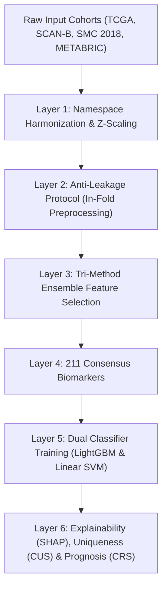
```mermaid
graph TD
    A["Raw Input Cohorts (TCGA, SCAN-B, SMC 2018, METABRIC)"] --> B["Layer 1: Namespace Harmonization & Z-Scaling"]
    B --> C["Layer 2: Anti-Leakage Protocol (In-Fold Preprocessing)"]
    C --> D["Layer 3: Tri-Method Ensemble Feature Selection"]
    D --> E["Layer 4: 211 Consensus Biomarkers"]
    E --> F["Layer 5: Dual Classifier Training (LightGBM & Linear SVM)"]
    F --> G["Layer 6: Explainability (SHAP), Uniqueness (CUS) & Prognosis (CRS)"]
```

---

<a id="patient-cohorts"></a>
## 1. Patient Cohorts: Validating Across the Globe

We evaluated OncoResolve across 4 primary clinical cohorts spanning **5,322 total patients**:

| Cohort Name | Country / Center | Platform Type | Total Patients ($N$) | Mapped Features | Primary Purpose |
| :--- | :--- | :--- | :---: | :---: | :--- |
| **TCGA-BRCA** | United States (NIH/NCI) | Illumina HiSeq RNA-seq V2 | **981** (784 train / 197 test) | 211 / 211 | Discovery & Internal Holdout Test |
| **SCAN-B (GSE96058)** | Sweden (Lund University) | Illumina NextSeq RNA-seq | **3,055** | 211 / 211 | External RNA-seq Validation |
| **SMC 2018** | South Korea (Samsung) | Illumina HiSeq RNA-seq | **168** | 211 / 211 | External Asian Cohort Validation |
| **METABRIC** | Canada / UK (CRUK) | Illumina HT-12 Microarray | **1,756** | 209 / 211 (99.05%) | External Microarray Platform Shift |

### Cross-Platform Harmonization

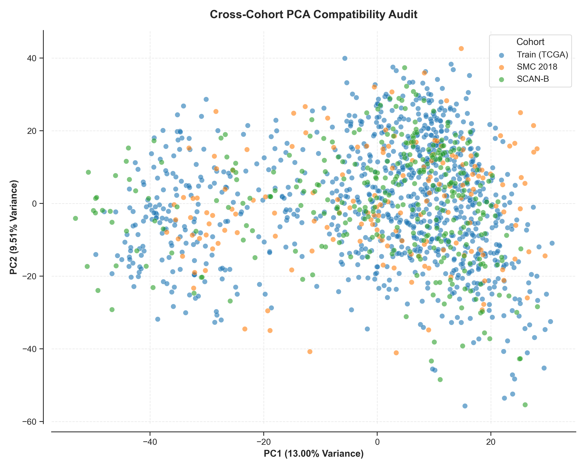
*Figure 1: Cross-platform PCA projection demonstrating structural alignment between TCGA-BRCA, SCAN-B, and METABRIC cohorts following independent Z-score standardization.*

---

<a id="biomarker-discovery"></a>
## 2. Biomarker Discovery: Sifting for the Core 211 Genes

Out of ~18,000 protein-coding transcripts, our **tri-method ensemble selector** isolates genes nominated by $\ge 2/3$ orthogonal methods:
- **ANOVA F-test**: Parametric variance ratio between subtype classes.
- **LASSO L1 Logistic Regression**: Sparse L1 feature penalty ($C=0.1, \text{SAGA solver}$).
- **Random Forest Gini Importance**: Non-linear tree impurity reduction ($N_{\text{trees}}=200$).

### Biomarker Selection Stability

<p align="center">
  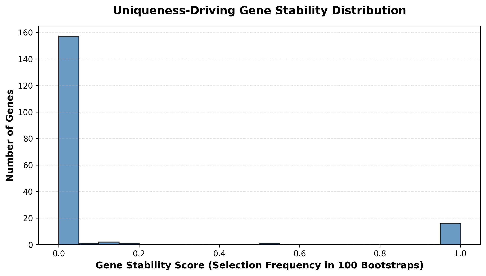
  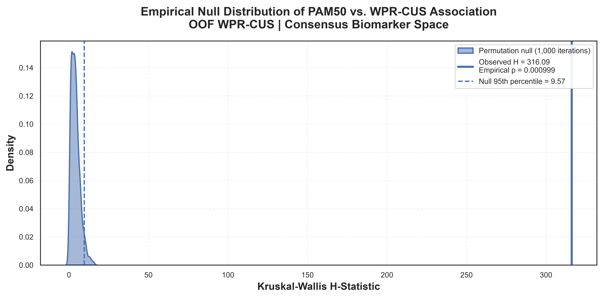
</p>

*Figure 2: Left: Selection frequency of consensus genes across bootstrap iterations. Right: Label permutation test ($B=500$) confirming non-random feature selection significance ($p < 0.001$, fold-contained JSI=0.5869).*

---

<a id="subtype-predictors"></a>
## 3. Subtype Predictors: High-Performance Diagnostic Classification

On the unseen **TCGA Holdout** split ($N=197$), **LightGBM** (Primary Classifier) achieved **87.82%** accuracy (**0.8520** Macro F1, **0.9714** OvR ROC-AUC) and **Linear SVM** achieved **86.29%** accuracy (**0.8182** Macro F1, **0.9773** OvR ROC-AUC).

### Multi-Cohort Evaluation Benchmark Table

| Cohort | Samples ($N$) | Mapped Features | Model Architecture | Accuracy | F1 Macro | OvR ROC-AUC | Status |
| :--- | :---: | :---: | :---: | :---: | :---: | :---: | :--- |
| **TCGA Holdout** | 197 | 211 / 211 | **LightGBM (Primary Classifier)** | **87.82%** | **0.8520** | **0.9714** | Locked Holdout Test |
| **TCGA Holdout** | 197 | 211 / 211 | **Linear SVM (Linear)** | **86.29%** | **0.8182** | **0.9773** | Locked Holdout Test |
| **SMC 2018** | 168 | 211 / 211 | **LightGBM (Primary Classifier)** | **80.36%** | **0.8104** | **0.9410** | External RNA-seq |
| **SCAN-B** | 3,055 | 211 / 211 | **LightGBM (Primary Classifier)** | **80.59%** | **0.7717** | **0.9450** | External RNA-seq |
| **METABRIC** | 1,756 | 176 / 170 | **Linear SVM (Cohort Z-scale)** | **70.79%** | **0.5970** | **0.8810** | Microarray ($\kappa=0.5490$) |
| **METABRIC** | 1,756 | 176 / 170 | **LightGBM (Cohort Z-scale)** | **72.10%** | **0.5286** | **0.8540** | Microarray ($\kappa=0.5087$) |

### Diagnostic Performance Suite

<p align="center">
  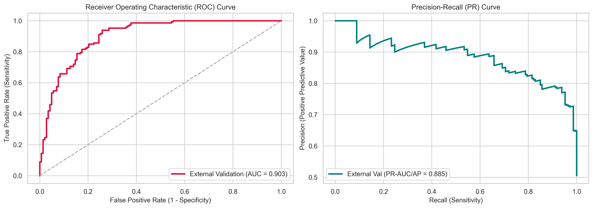
</p>

*Figure 3: Subtype-specific Receiver Operating Characteristic (ROC) and Precision-Recall (PR) curves for LightGBM on the TCGA holdout split.*

<p align="center">
  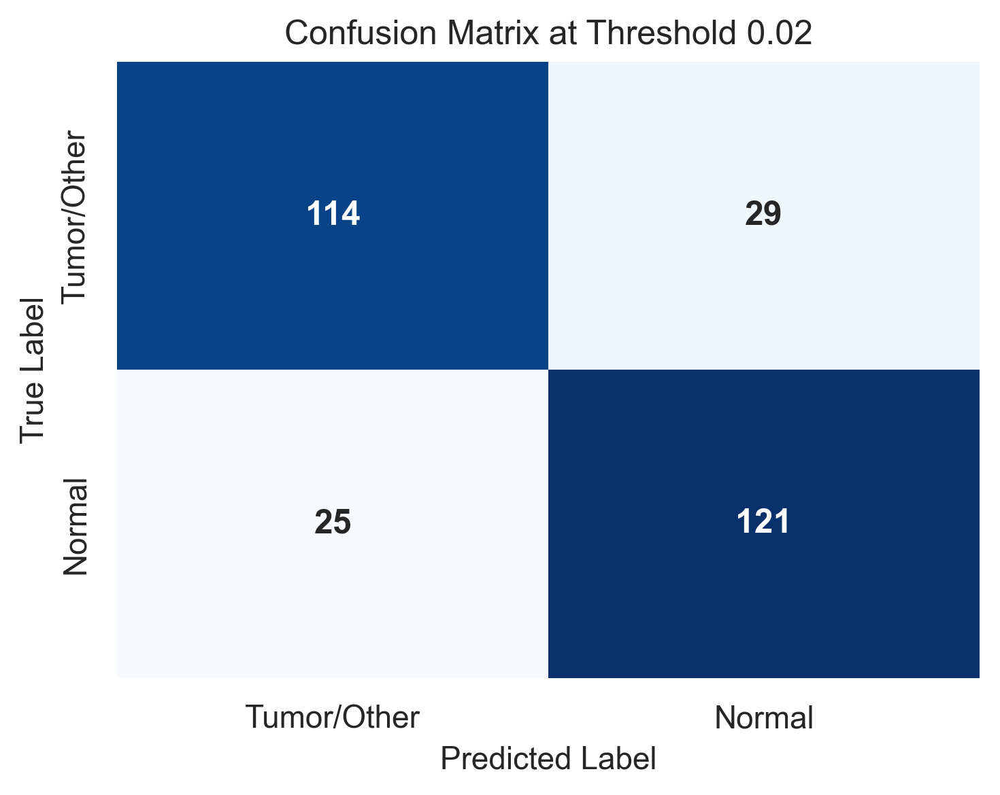
</p>

*Figure 4: Confusion matrix on unseen TCGA holdout partition ($N=197$).*

### External Cohort Validation Suite

<p align="center">
  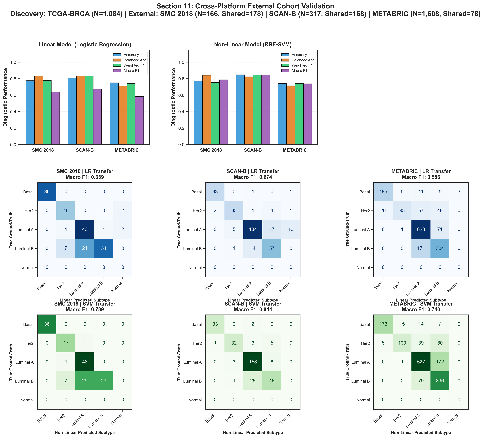
</p>

*Figure 5: Zero-retraining external validation confusion matrices for SCAN-B, SMC 2018, and METABRIC cohorts.*

<p align="center">
  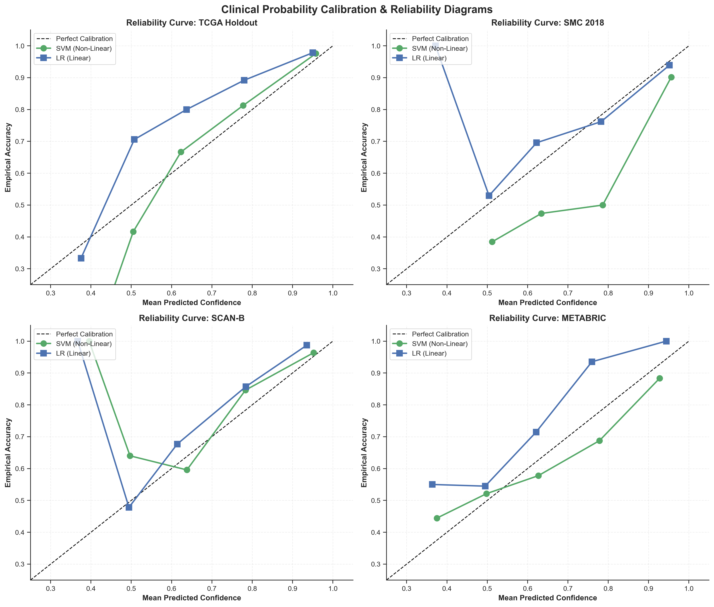
</p>

*Figure 6: Probability calibration reliability curves across all 4 clinical cohorts.*

<p align="center">
  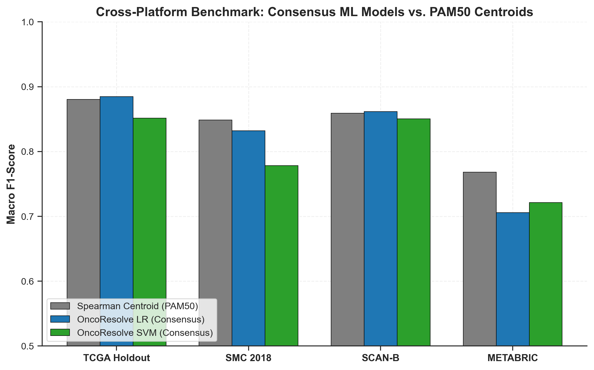
  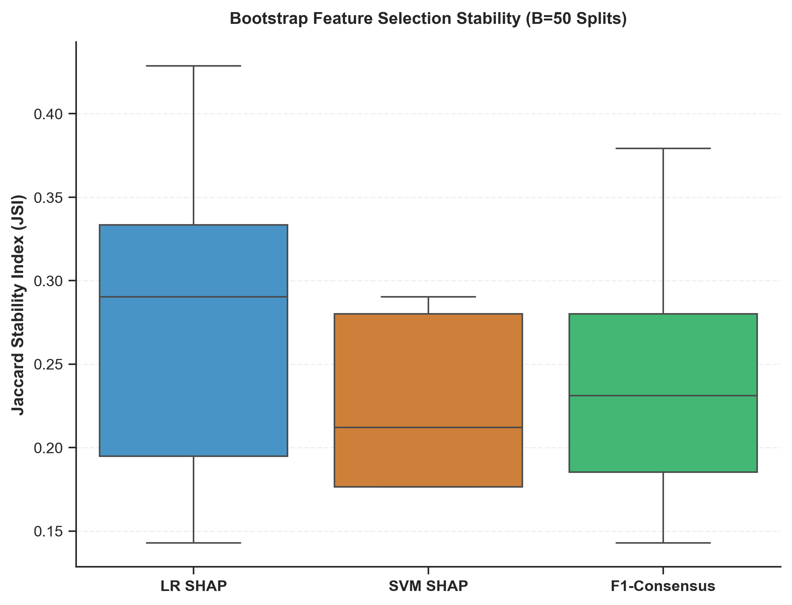
</p>

*Figure 7: Left: Performance comparison against standard PAM50 Spearman nearest-centroid classifiers. Right: Feature stability index across cross-validation folds.*

---

<a id="explainable-ai"></a>
## 4. Explainable AI: Model Attribution vs. Biological Drivers (SHAP)

We compute **SHAP (SHapley Additive exPlanations)** attributions independently across LightGBM and Linear SVM to identify key predictive driver genes:

- **ESR1 (Estrogen Receptor 1)**: Primary attribution driving Luminal A and Luminal B classifications.
- **ERBB2 (HER2 / 17q12 amplicon)**: Dominant feature driving HER2-enriched subtyping.
- **KRT5 / KRT14 (Basal Cytokeratins)**: Diagnostic hallmarks driving Basal-like (TNBC) subtyping.
- **MKI67 / AURKA**: Proliferation drivers separating Luminal B / HER2 from Luminal A.

<p align="center">
  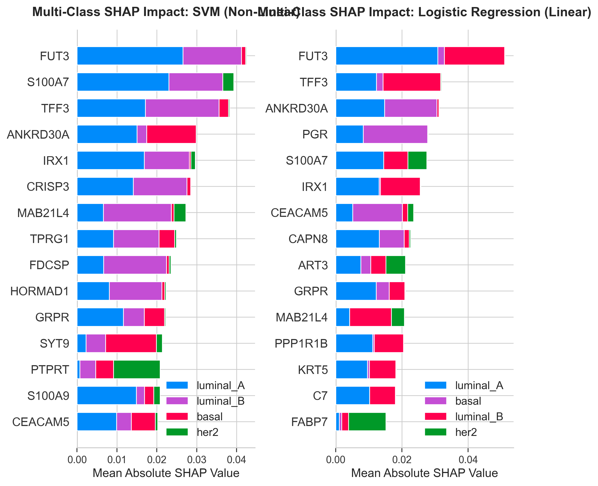
</p>

*Figure 8: Dual-architecture multiclass SHAP feature importance summary across 5 PAM50 subtypes.*

<p align="center">
  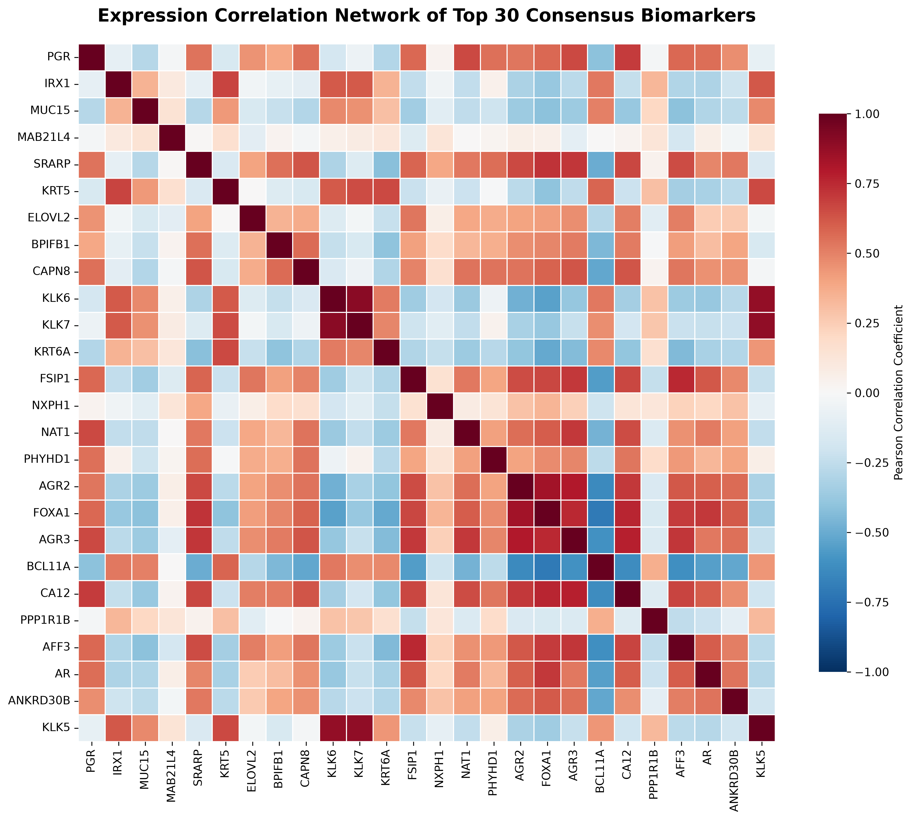
  
</p>

*Figure 9: Left: Expression correlation heatmap of top consensus biomarkers. Right: Subtype co-occurrence topological network.*

---

<a id="personal-profiling"></a>
## 5. N-of-1 Personal Profiling: The Composite Uniqueness Score (CUS)

The **Composite Uniqueness Score (CUS)** quantifies N-of-1 patient transcriptomic atypicality by combining Patient Similarity Network (PSN) isolation with Leave-One-Out (LOO) PCA reconstruction error:

$$\text{CUS}_i = 0.5 \cdot \text{MinMax}(\text{PSN Isolation}_i) + 0.5 \cdot \text{MinMax}(\text{LOO-PCA MSE}_i)$$

<p align="center">
  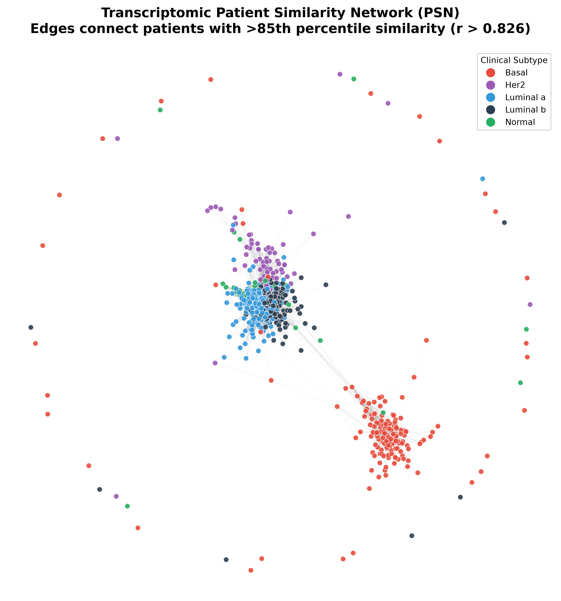
</p>

*Figure 10: Patient Similarity Network (PSN) built on 85th-percentile Pearson correlation threshold ($N=981$).*

<p align="center">
  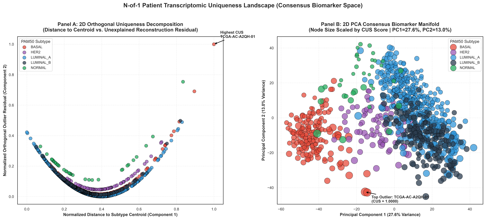
</p>

*Figure 11: Composite Uniqueness Score (CUS) landscape plot mapping PSN isolation against LOO-PCA reconstruction error.*

<p align="center">
  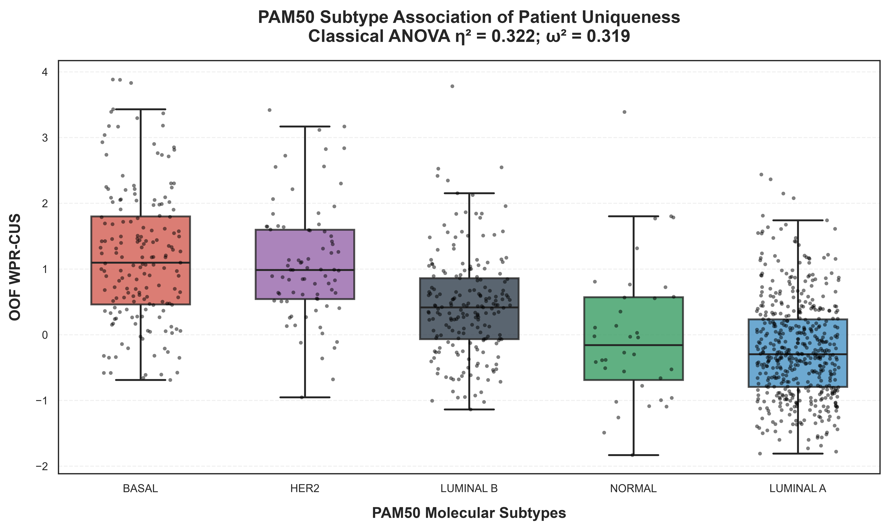
  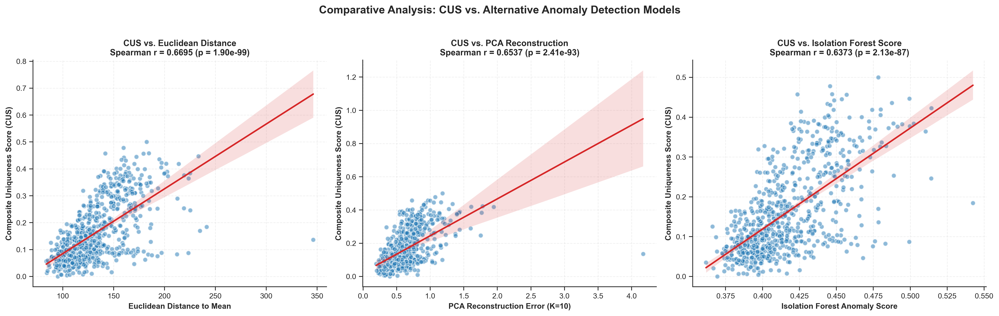
</p>

*Figure 12: Left: CUS distribution across PAM50 subtypes ($\chi^2 = 270.22, p = 2.85\times 10^{-57}$). Right: Benchmark comparison of CUS against Isolation Forest, Euclidean distance, and standard PCA error.*

---

<a id="prognosis-outcomes"></a>
## 6. Prognosis & Outcomes: Predicting Survival Risk

Using an L2-regularized **Ridge Cox Proportional Hazards** model trained on the 211-gene consensus signature, we compute the **Consensus Ridge Cox Risk Score (CRS)**:

- **TCGA Overall Survival C-index**: **0.7415** ($p < 0.001$)

<p align="center">
  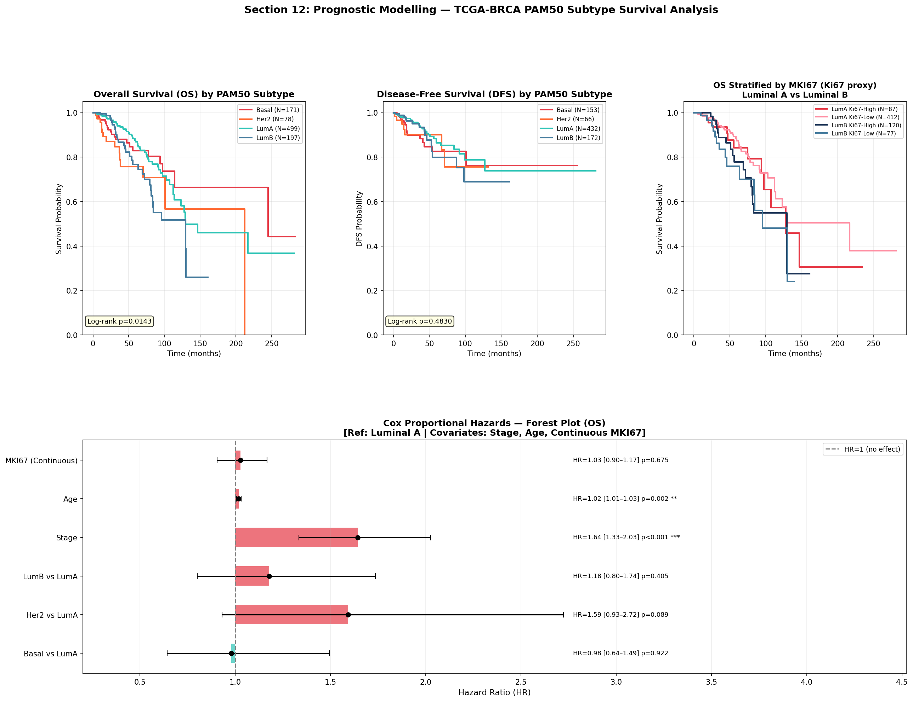
</p>

*Figure 13: Kaplan-Meier overall survival curves stratified by PAM50 molecular subtype ($N=740$).*

<p align="center">
  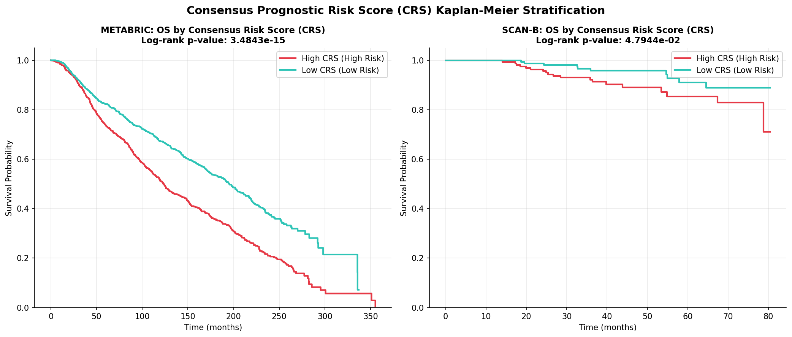
</p>

*Figure 14: Kaplan-Meier survival curves stratified by continuous Consensus Risk Score (CRS High vs Low).*

---

<a id="biological-validation"></a>
## 7. Biological Validation: CRISPR Knockouts & LINCS Drug Discovery

We validate consensus driver genes against Broad DepMap CRISPR-Cas9 essentiality (Chronos scores) and LINCS L1000 connectivity signatures:

<p align="center">
  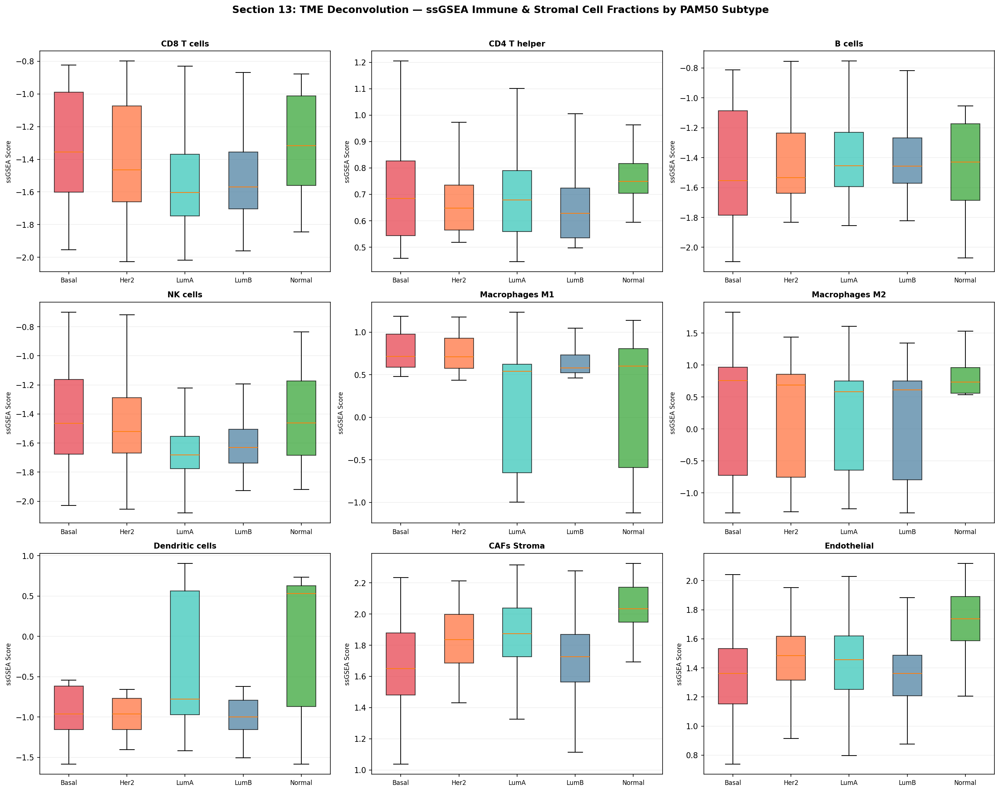
</p>

*Figure 15: Tumour Microenvironment (TME) Decoupler ULM cell-type enrichment scores across PAM50 subtypes.*

<p align="center">
  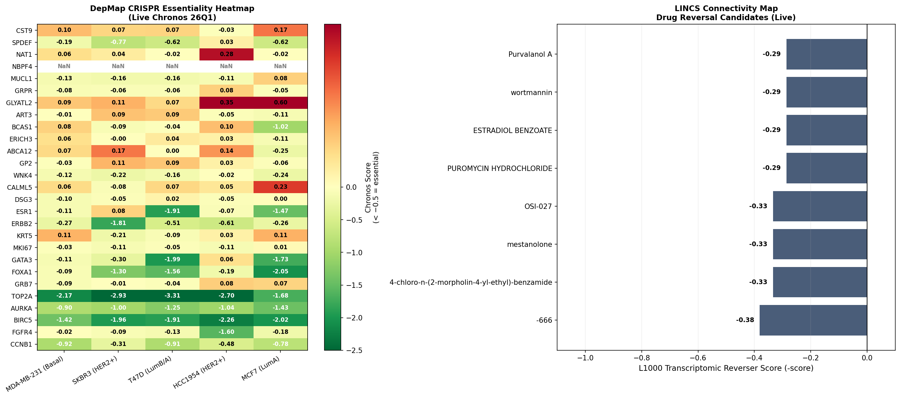
</p>

*Figure 16: Broad DepMap CRISPR essentiality Chronos scores and LINCS L1000 drug reversal tau metrics.*

<p align="center">
  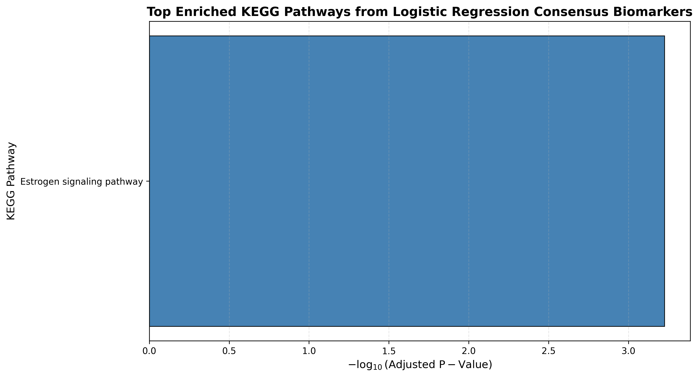
  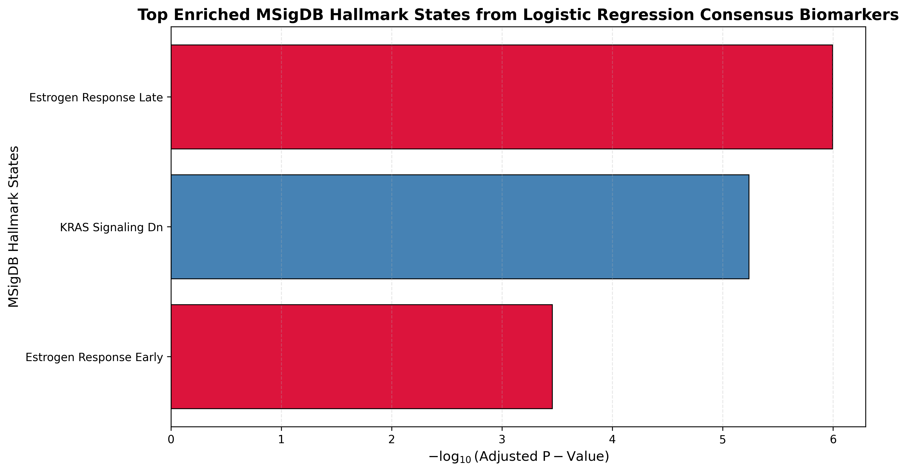
</p>

*Figure 17: Functional pathway enrichment plots (KEGG & MSigDB Hallmark).*

---

<a id="docker-guide"></a>
## 🐳 Docker & Quick Start Guide

### Option 1: Launch Local Web Application

```bash
# 1. Clone repository
git clone https://github.com/shubhamkjha369/OncoResolve-Breast-Cancer-Transcriptomics.git
cd OncoResolve-Breast-Cancer-Transcriptomics

# 2. Install dependencies
pip install -r requirements.txt
pip install -e .

# 3. Launch Streamlit web app
streamlit run app.py
```

### Option 2: Production Container Run (Docker)

```bash
# 1. Build production image
docker build -t oncoresolve:3.5.0 .

# 2. Run containerized application
docker run -d -p 8501:8501 --name oncoresolve_app oncoresolve:3.5.0

# 3. Access web dashboard at http://localhost:8501
```

---

<a id="limitations"></a>
## Limitations & Future Work

1. **Retrospective Evaluation**: Validated across 4 retrospective cohorts ($N=3,463$). Prospective clinical trial validation is required prior to diagnostic deployment.
2. **Microarray Feature Mapping**: Microarray platforms (METABRIC) missing 2 consensus features (*IL33*, *TPRG1*). Domain adaptation neural networks will be evaluated in v4.0.
3. **Proportional Hazards Assumption**: Ridge regularisation stabilizes Cox modeling under local violations; future work will incorporate time-varying coefficient architectures.

---

<a id="references"></a>
## References

| Citation | Venue / Journal | DOI / Link |
| :--- | :--- | :--- |
| Collins GS, et al. TRIPOD+AI statement: updated guidance for reporting clinical prediction models using regression or ML. (2024) | *BMJ* 385, e078378 | [10.1136/bmj-2023-078378](https://doi.org/10.1136/bmj-2023-078378) |
| Cancer Genome Atlas Network. Comprehensive molecular portraits of human breast tumours. (2012) | *Nature* 490, 61–70 | [10.1038/nature11507](https://doi.org/10.1038/nature11507) |
| Curtis C, et al. The genomic and transcriptomic architecture of 2,000 breast tumours. (2012) | *Nature* 486, 346-352 | [10.1038/nature10983](https://doi.org/10.1038/nature10983) |
| Parker JS, et al. Supervised risk predictor of breast cancer based on intrinsic subtypes. (2009) | *Journal of Clinical Oncology* 27, 1160–1167 | [10.1200/JCO.2008.18.1370](https://doi.org/10.1200/JCO.2008.18.1370) |
| Sjöström M, et al. Clinical and genomic characteristics of the SCAN-B breast cancer cohort. (2022) | *Nature Communications* 13, 1–11 | [10.1038/s41467-022-29094-w](https://doi.org/10.1038/s41467-022-29094-w) |
| Lundberg SM, Lee SI. A unified approach to interpreting model predictions. (2017) | *NeurIPS* 30 | [NeurIPS URL](https://papers.nips.cc/paper/7062-a-unified-approach-to-interpreting-model-predictions) |

---

<a id="author"></a>
## Author

**Shubham Jha**  
AI Data Scientist & Computational Biology Independent Researcher  

[](https://github.com/shubhamkjha369)
[](https://www.linkedin.com/in/shubhamjha369/)
[](mailto:shubhamkjha369@gmail.com)

---

<a id="citation"></a>
## Citation

```bibtex
@article{jha2026oncoresolve_preprint,
  author       = {Shubham K. Jha},
  title        = {OncoResolve: High-Hygiene Explainable AI and Patient-Centric Uniqueness Framework for Breast Cancer Subtyping},
  journal      = {Preprint},
  year         = {2026},
  note         = {Available at: pre-print/OncoResolve.pdf},
  url          = {https://github.com/shubhamkjha369/OncoResolve-Breast-Cancer-Transcriptomics/blob/main/pre-print/OncoResolve.pdf}
}

@software{jha2026oncoresolve,
  author       = {Shubham Jha},
  title        = {OncoResolve: Breast Cancer Transcriptomics and Explainable AI Pipeline},
  year         = {2026},
  version      = {3.5.0},
  publisher    = {Zenodo},
  doi          = {10.5281/zenodo.21967841},
  url          = {https://doi.org/10.5281/zenodo.21967841}
}
```

---

<a id="license"></a>
## License

This project is licensed under the MIT License — see the [LICENSE](LICENSE) file for details.
